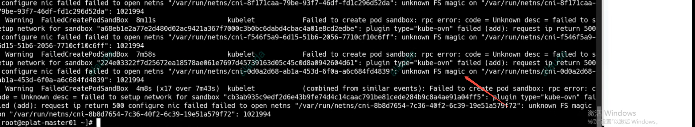
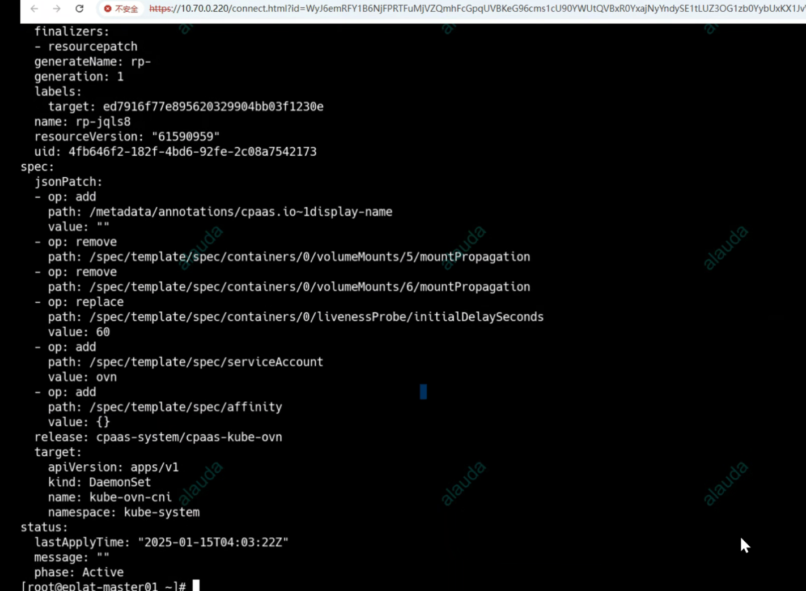

---
kind:
  - Troubleshooting
products:
  - Alauda Container Platform
  - Alauda DevOps
  - Alauda AI
  - Alauda Application Services
  - Alauda Service Mesh
  - Alauda Developer Portal
ProductsVersion:
  - 4.1.0,4.2.x
---
<!-- A type of document that involves encountering a fault, diagnosing it, performing root cause analysis, and providing solutions. -->

# 宝信 所有启动的pod报 unknown FS magic

所有启动的pod报unknown FS magic

## Cause
- 修改kube-ovn-cni的volumemount配置导致异常

## Resolution
- 删除kube-ovn-cni相关的resourcePatch配置

## [workaround]

## [Related Information]
**Screenshots**

- Environment: CNI版本：1.9.33 kubeovn
- kube-ovn-cni
- resourcePatch
- Component: Kubernetes
- Page ID: 258476183
- Original Title: 宝信 所有启动的pod报 unknown FS magic
