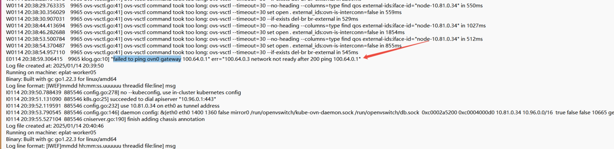

---
kind:
  - Troubleshooting
products:
  - Alauda Container Platform
  - Alauda DevOps
  - Alauda AI
  - Alauda Application Services
  - Alauda Service Mesh
  - Alauda Developer Portal
ProductsVersion:
  - 4.1.0,4.2.x
---
<!-- A type of document that involves encountering a fault, diagnosing it, performing root cause analysis, and providing solutions. -->

# 宝信流表丢失导致访问ovn0 不通cni起不来

kube-ovn-cni 启动失败 ovn0 访问不通 ovs-vswitchd/ovn-controller 出现高负载日志: 'unreasonably long poll xxxxxms interval' 和 'waiting for main to quiesce'

## Cause
- CPU 异常高负载导致 ovs-vswitchd/ovn-controller 进程处理异常
- 流表生成异常导致网络功能失效

## Resolution
- 删除并重启 ovs-ovn 组件

## [workaround]

## [Related Information]
**Screenshots**

- Environment: 操作系统: 麒麟 sp1 | CNI: overlay 1.9
- ovs-ovn
- ovn-controller
- ovs-vswitchd
- kube-ovn-cni
- ovn0
- Component: Kubernetes
- Page ID: 260014644
- Original Title: 宝信流表丢失导致访问ovn0 不通cni起不来
