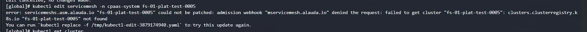

---
kind:
  - Troubleshooting
products:
  - Alauda Container Platform
  - Alauda DevOps
  - Alauda AI
  - Alauda Application Services
  - Alauda Service Mesh
  - Alauda Developer Portal
ProductsVersion:
  - 4.1.0,4.2.x
---
<!-- A type of document that involves encountering a fault, diagnosing it, performing root cause analysis, and providing solutions. -->

# 网格部署集群已被删除，网格删除一直删除中

网格删除一直处于删除中状态 kubectl get servermesh -A 显示状态为Provisioning 尝试删除finalizers字段时报错：admission webhook denied the request: failed to get cluster

## Cause
- admission webhook拦截请求时发现关联的集群资源已不存在
- servicemesh资源存在finalizers导致删除被阻塞

## Resolution
- 执行命令确定拦截的webhook：for i in $(kubectl get mutatingwebhookconfigurations | awk '{print $1}'); do echo "###########$i############" && kubectl get mutatingwebhookconfigurations $i -o yaml | grep mservicemesh.alauda.io; done
- 备份并删除webhook配置：kubectl get mutatingwebhookconfigurations servicemesh-v1alpha1-mutation -oyaml > servicemesh.yaml && kubectl delete mutatingwebhookconfigurations servicemesh-v1alpha1-mutation
- 删除servicemesh资源并恢复webhook：kubectl delete servicemesh -n cpaas-sytem fs-01-plat-test-0005 && kubectl apply -f servicemesh.yaml

## [workaround]
- 临时删除mutatingwebhookconfigurations配置以绕过拦截

## [Related Information]
**Screenshots**

- Environment: 3.16.2
- servicemesh.asm.alauda.io
- mutatingwebhookconfigurations
- clusters.clusterregistry.k8s.io
- servicemesh-v1alpha1-mutation
- Component: Kubernetes
- Page ID: 264799236
- Original Title: 网格部署集群已被删除，网格删除一直删除中
