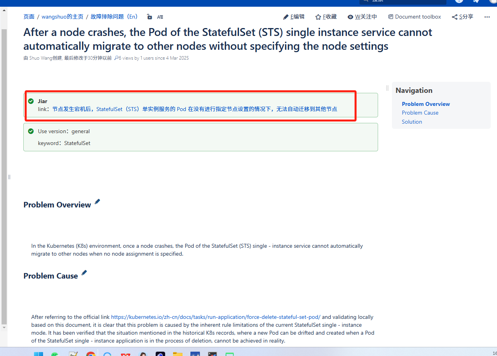
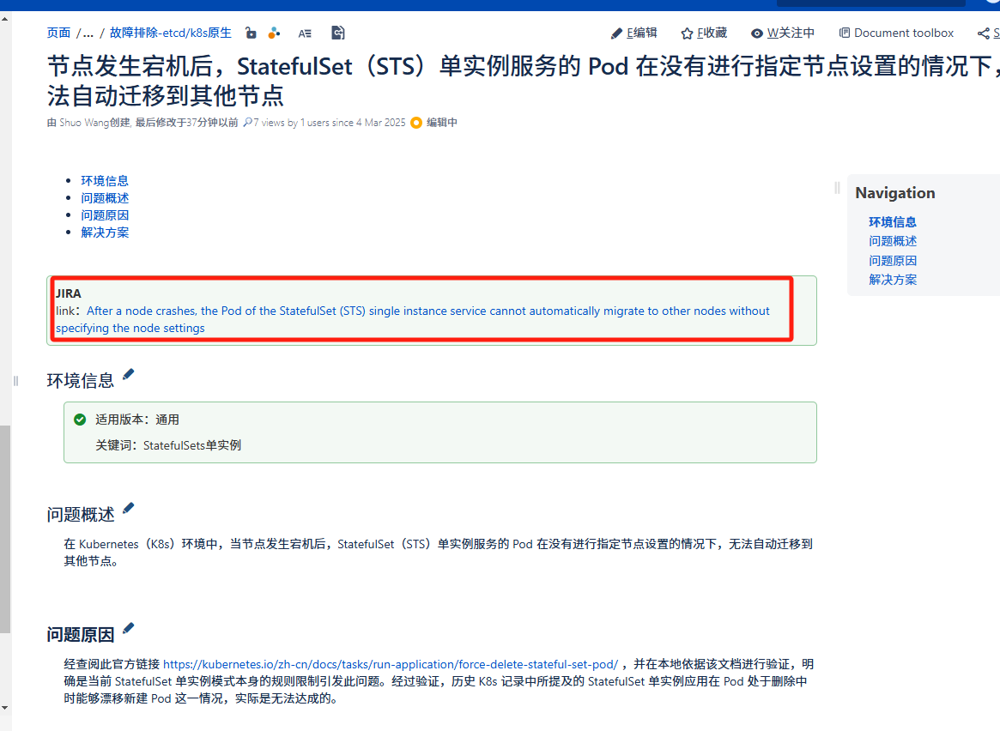

---
kind:
  - Troubleshooting
products:
  - Alauda Container Platform
  - Alauda DevOps
  - Alauda AI
  - Alauda Application Services
  - Alauda Service Mesh
  - Alauda Developer Portal
ProductsVersion:
  - 4.1.0,4.2.x
---
<!-- A type of document that involves encountering a fault, diagnosing it, performing root cause analysis, and providing solutions. -->

# 故障排除问题（En）

知识库文档优化技巧示例 将工单总结的问题内容，上传到相关AI工具内，已如下内容进行要求

## Cause

## Resolution

## [workaround]

## [Related Information]
**Screenshots**

- Component: Kubernetes
- Page ID: 268534729
- Original Title: 故障排除问题（En）
