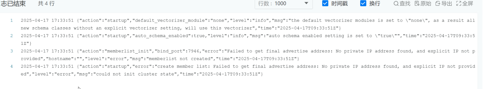
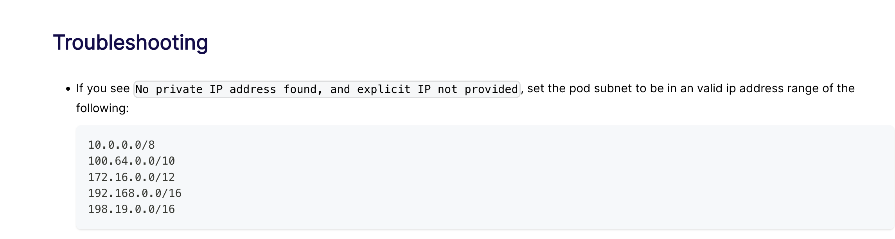

---
kind:
  - Troubleshooting
products:
  - Alauda Container Platform
  - Alauda DevOps
  - Alauda AI
  - Alauda Application Services
  - Alauda Service Mesh
  - Alauda Developer Portal
ProductsVersion:
  - 4.1.0,4.2.x
---
<!-- A type of document that involves encountering a fault, diagnosing it, performing root cause analysis, and providing solutions. -->

# dify 部署报错常见问题

weaviate 组件起不来

## Cause
- 部署时使用的网络子网不符合 weaviate 要求

## Resolution
- 按照 weaviate 官方 Kubernetes 安装文档要求新建符合规范的子网

## [workaround]

## [Related Information]
**Screenshots**

- Environment: Kubernetes 环境部署
- weaviate
- kubernetes
- Component: Kubernetes
- Page ID: 277807619
- Original Title: dify 部署报错常见问题
