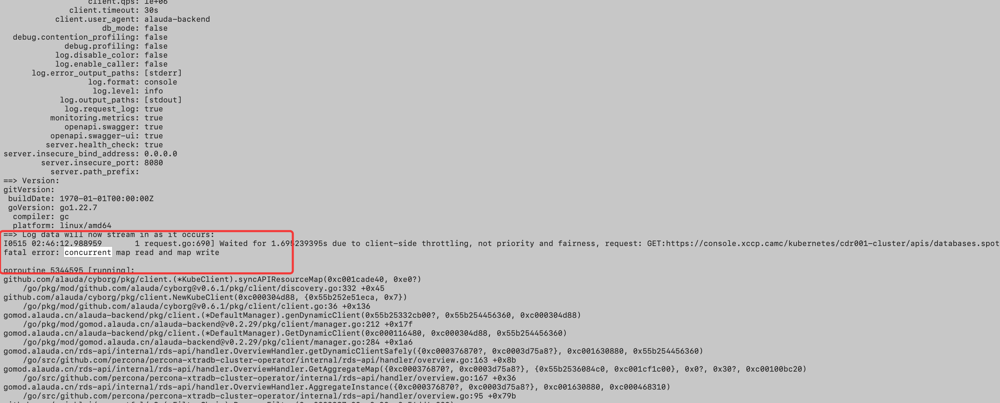

---
kind:
  - Troubleshooting
products:
  - Alauda Container Platform
  - Alauda DevOps
  - Alauda AI
  - Alauda Application Services
  - Alauda Service Mesh
  - Alauda Developer Portal
ProductsVersion:
  - 4.1.0,4.2.x
---
<!-- A type of document that involves encountering a fault, diagnosing it, performing root cause analysis, and providing solutions. -->

# rds

内存不足的错误提示 内存使用率在重启前达到95%以上 服务因OOM被终止

## Cause
- rds-api服务配置的内存限制不足

## Resolution
- 调整rds-api的Pod资源限制增加内存配额
- 优化服务内存使用减少不必要的缓存
- 设置合理的HPA策略
- 加强监控告警在内存使用率80%预警

## [workaround]

## [Related Information]
**Screenshots**

- Environment: v3.18.1
- Pod资源限制
- HPA(Horizontal Pod Autoscaler)
- OOM Killer
- 内存监控
- Component: Kubernetes
- Page ID: 299139850
- Original Title: 数据服务-rds-api重启-108517-zh
