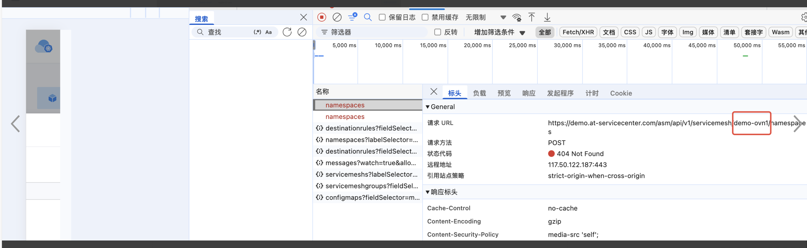
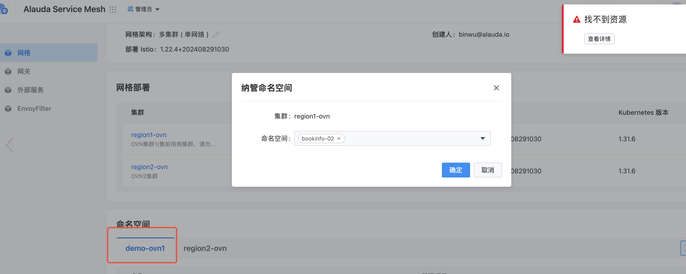
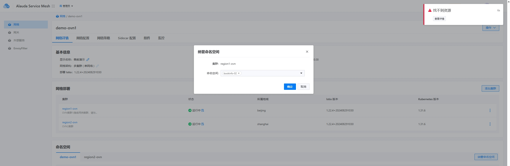

---
kind:
  - Troubleshooting
products:
  - Alauda Container Platform
  - Alauda DevOps
  - Alauda AI
  - Alauda Application Services
  - Alauda Service Mesh
  - Alauda Developer Portal
ProductsVersion:
  - 4.1.0,4.2.x
---
<!-- A type of document that involves encountering a fault, diagnosing it, performing root cause analysis, and providing solutions. -->

# demo.at 售前演示环境，微服务平台服务纳管命名空间

系统未能正确识别或处理命名空间配置 纳管过程中存在权限验证失败的错误信息

## Cause
- 命名空间的标签（labels）配置不符合微服务平台的纳管要求

## Resolution
- 为命名空间添加符合规范的标签
- 检查微服务平台版本与Kubernetes集群API版本的兼容性

## [workaround]

## [Related Information]
**Screenshots**

- Environment: v3.18.0
- Kubernetes命名空间标签
- 微服务平台权限设置
- Kubernetes API版本
- Component: Kubernetes
- Page ID: 302286049
- Original Title: 微服务-demo.at 售前演示环境，微服务平台服务纳管命名空间-110572-zh
