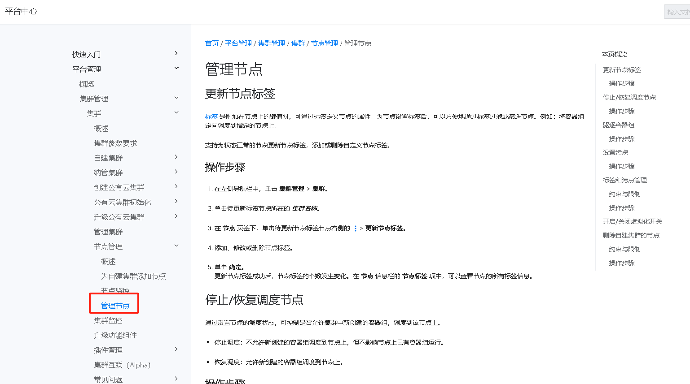

---
kind:
  - Troubleshooting
products:
  - Alauda Container Platform
  - Alauda DevOps
  - Alauda AI
  - Alauda Application Services
  - Alauda Service Mesh
  - Alauda Developer Portal
ProductsVersion:
  - 4.1.0,4.2.x
---
<!-- A type of document that involves encountering a fault, diagnosing it, performing root cause analysis, and providing solutions. -->

# 能否通过添加强制标签，限制项目部署在集群的某几个节点上

JIRA Jira：

## Cause
- 需要将工作负载调度到特定硬件/软件配置节点
- 出于隔离和安全性的考虑

## Resolution
- 使用命令给节点打标签: kubectl label nodes <node-name> <label-key>=<label-value>
- 在Pod配置中添加nodeSelector字段:
apiVersion: v1
kind: Pod
metadata:
  name: nginx
spec:
  containers:
  - name: nginx
    image: nginx
  nodeSelector:
    <label-key>: <label-value>
- 使用节点亲和性(nodeAffinity)定义复杂调度策略

## [workaround]

## [Related Information]
**Screenshots**

- Environment: v3.18.1
- nodeSelector
- nodeAffinity
- kubectl label
- 节点标签
- Assigning Pods to Nodes
- Component: Kubernetes
- Page ID: 308806186
- Original Title: 容器平台-能否通过添加强制标签，限制项目部署在集群的某几个节点上-111502-zh
