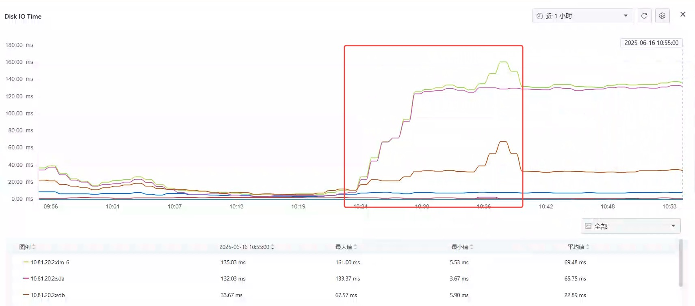
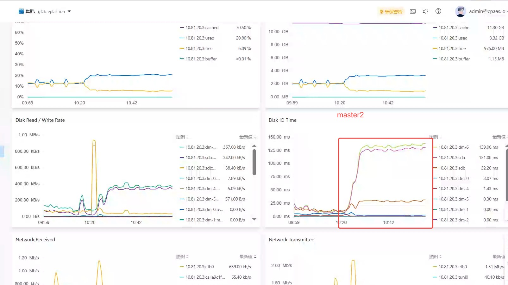
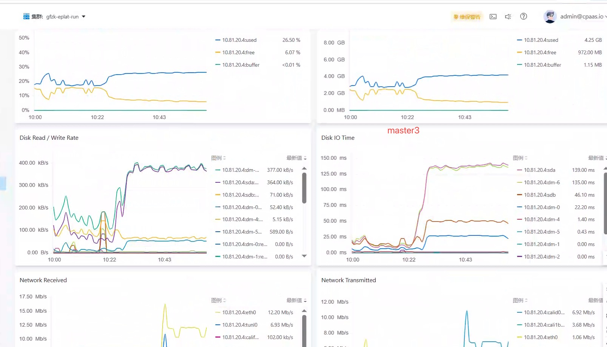
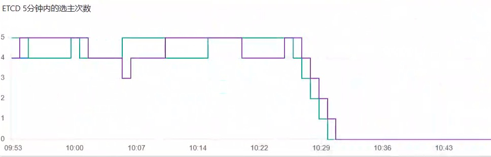
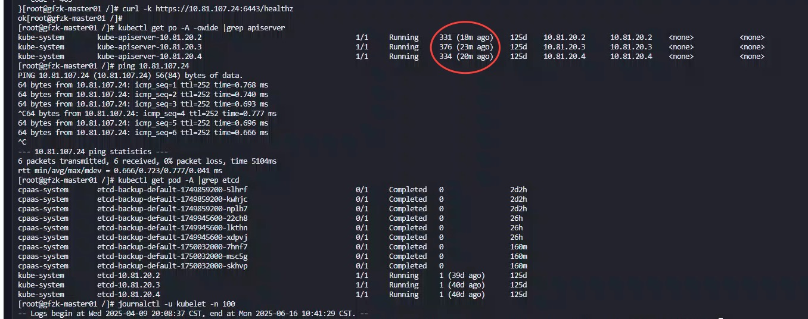
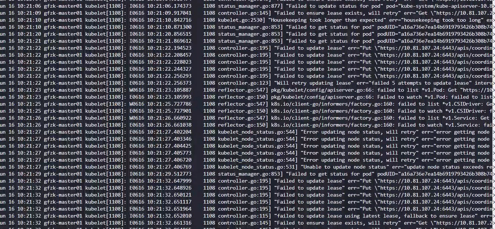
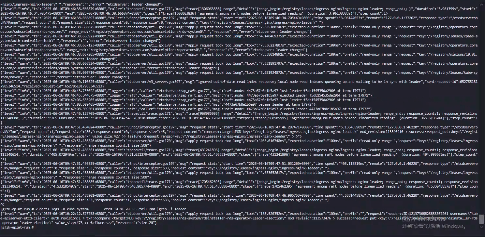

---
kind:
  - Troubleshooting
products:
  - Alauda Container Platform
  - Alauda DevOps
  - Alauda AI
  - Alauda Application Services
  - Alauda Service Mesh
  - Alauda Developer Portal
ProductsVersion:
  - 4.1.0,4.2.x
---
<!-- A type of document that involves encountering a fault, diagnosing it, performing root cause analysis, and providing solutions. -->

# controller

controller-manager频繁重启 Pod处于CrashLoopBackOff状态 OOM（内存不足）错误日志

## Cause
- controller-manager内存资源不足

## Resolution
- 增加controller-manager Pod内存限制
- 调整controller-manager启动参数优化内存使用
- 持续监控运行状态

## [workaround]

## [Related Information]
**Screenshots**

- Environment: Kubernetes v3.18.1
- kube-controller-manager
- Pod资源限制配置
- CrashLoopBackOff
- OOMKilled
- Component: Kubernetes
- Page ID: 308820913
- Original Title: 基础架构-controller-manager出现异常-110731-zh
