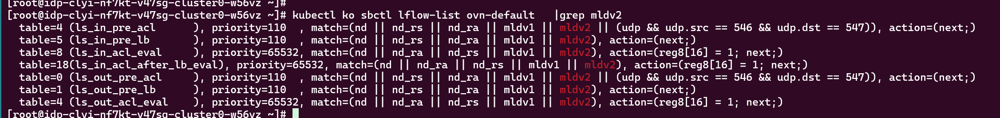

---
kind:
  - Troubleshooting
products:
  - Alauda Container Platform
  - Alauda DevOps
  - Alauda AI
  - Alauda Application Services
  - Alauda Service Mesh
  - Alauda Developer Portal
ProductsVersion:
  - 4.1.0,4.2.x
---
<!-- A type of document that involves encountering a fault, diagnosing it, performing root cause analysis, and providing solutions. -->

# 开启nodelocaldns和networkpolicy后域名解析失败。

开启nodelocaldns和networkpolicy后域名解析失败

## Cause
- nodelocaldns返回业务pod的报文被丢弃，需在流表中放行源IP为169.254.20.10的报文
- nodelocaldns请求coredns pod时使用节点IP，networkpolicy未放行节点IP段

## Resolution
- 更新networkpolicy，放行100.64.0.0/16、192.168.0.0/16、169.254.20.10/32 CIDR，并配置egress规则

## [workaround]

## [Related Information]
**Screenshots**

- Environment: CNI 版本：1.14.0
- nodelocaldns
- NetworkPolicy
- CoreDNS
- 169.254.20.10
- 100.64.0.0/16
- 192.168.0.0/16
- 53/UDP
- kube-system
- ovn流表
- https://github.com/kubeovn/kube-ovn/pull/5400
- Component: Kubernetes
- Page ID: 310085067
- Original Title: 开启nodelocaldns和networkpolicy后域名解析失败。
