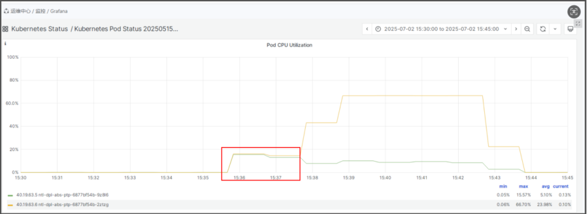
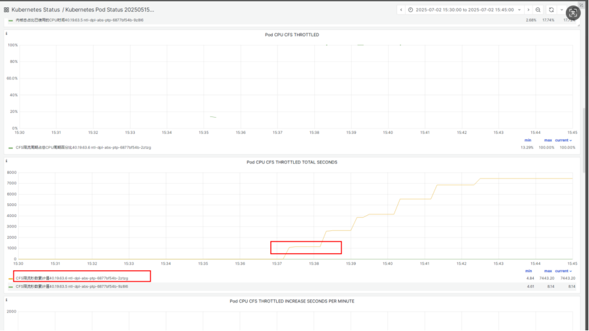
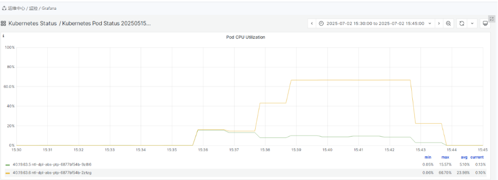
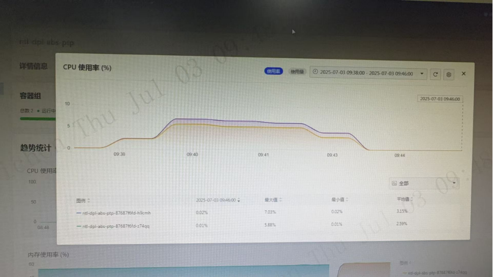
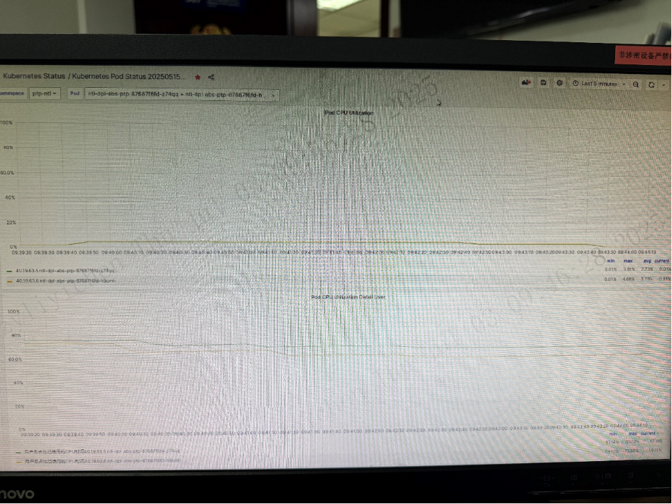

---
kind:
  - Troubleshooting
products:
  - Alauda Container Platform
  - Alauda DevOps
  - Alauda AI
  - Alauda Application Services
  - Alauda Service Mesh
  - Alauda Developer Portal
ProductsVersion:
  - 4.1.0,4.2.x
---
<!-- A type of document that involves encountering a fault, diagnosing it, performing root cause analysis, and providing solutions. -->

# Pod 触发CPU

问题 Pod 的 nr_throttled（限流次数）快速增加，throttled_time（限流时长）增长 问题 Pod CPU 使用率达到 66.7%，另一 Pod 仅 15% 调整 CPU 配置至 30G 后未触发 CFS 限流，使用量均衡

## Cause
- 问题 Pod 的 CPU 资源配置（limits: cpu: "4"）不足
- CFS 限流导致请求堆积并触发重试，形成恶性循环
- 默认轮询负载均衡策略无法转移堆积流量
- 节点存在其他高负载进程或 CPU 超售
- 问题 Pod 承接 30 个并发连接（另一 Pod 仅 2 个）

## Resolution
- 调整 CPU 资源配额（如 limits: cpu: "30"）
- 优化应用处理逻辑减少无效计算
- 检查节点资源竞争情况
- 采用智能负载均衡策略替代轮询
- 优化客户端重试机制

## [workaround]

## [Related Information]
**Screenshots**

****
****
****
- Environment: Kubernetes 集群
- CFS
- Kubernetes CPU limits
- nr_throttled/throttled_time
- 轮询负载均衡策略
- 节点资源超售
- 客户端重试机制
- Component: Kubernetes
- Page ID: 311558706
- Original Title: Pod 触发CPU-cfs限流到的cpu不均衡问题分析
