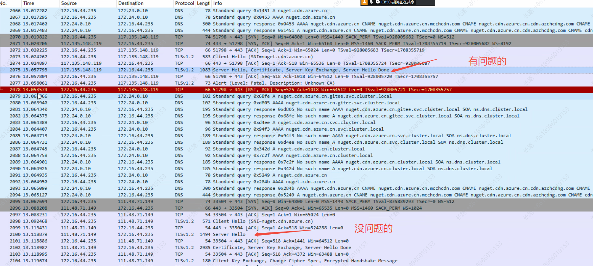
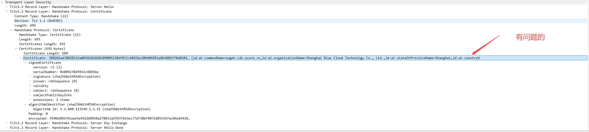
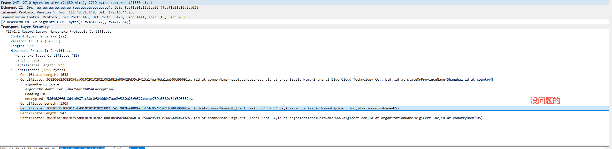

---
kind:
  - Troubleshooting
products:
  - Alauda Container Platform
  - Alauda DevOps
  - Alauda AI
  - Alauda Application Services
  - Alauda Service Mesh
  - Alauda Developer Portal
ProductsVersion:
  - 4.1.0,4.2.x
---
<!-- A type of document that involves encountering a fault, diagnosing it, performing root cause analysis, and providing solutions. -->

# 合肥晶合集群内pod 下载外网的文件时好时坏

pod内curl外网文件时好时坏 请求同一域名解析到不同IP时出现证书认证差异 117.136.148.119返回unknown CA错误

## Cause
- 服务器返回的证书链不完整(仅终端证书)
- CDN配置导致不同节点返回差异

## Resolution
- 检查CDN配置确保返回完整证书链

## [workaround]

## [Related Information]
**Screenshots**

- Environment: acp 3.18.1
- 域名解析
- 证书链
- CDN配置
- TLS握手过程
- Component: Kubernetes
- Page ID: 316670691
- Original Title: 合肥晶合集群内pod 下载外网的文件时好时坏
