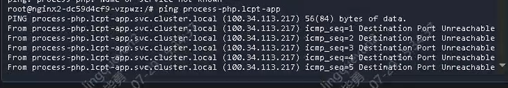
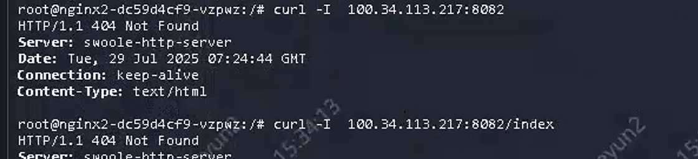

---
kind:
  - Troubleshooting
products:
  - Alauda Container Platform
  - Alauda DevOps
  - Alauda AI
  - Alauda Application Services
  - Alauda Service Mesh
  - Alauda Developer Portal
ProductsVersion:
  - 4.1.0,4.2.x
---
<!-- A type of document that involves encountering a fault, diagnosing it, performing root cause analysis, and providing solutions. -->

# 测试环境同项目不同命名空间的容器访问受限

lcpt-middleware空间下process-nginx访问lcpt-app空间应用受限 跨命名空间ping不通但TCP/UDP端口可访问

## Cause
- Kubernetes内部路由使用虚拟IP不支持ICMP协议

## Resolution

## [workaround]
- 使用TCP/UDP协议进行连通性测试代替ICMP ping检测

## [Related Information]
**Screenshots**

- Environment: 3.18.1
- k8s内部路由
- 虚拟IP
- CNI组件
- Component: Kubernetes
- Page ID: 324174413
- Original Title: 容器平台-网络-其他CNI组件-测试环境同项目不同命名空间的容器访问受限-114004
