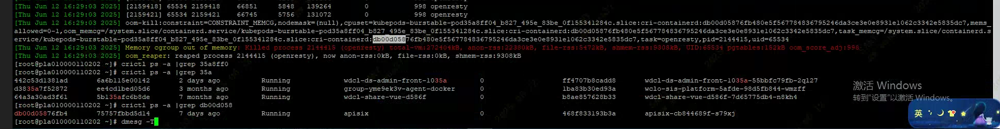
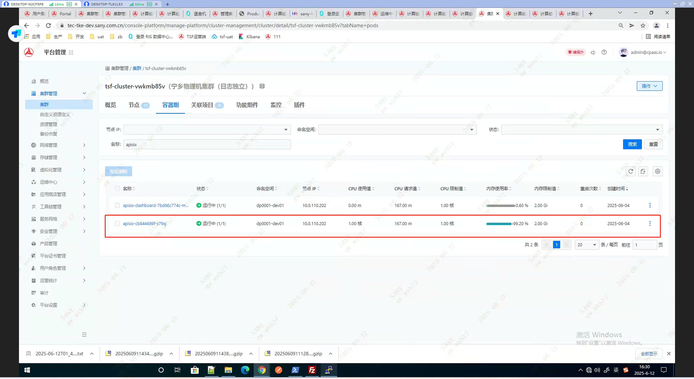

---
kind:
  - Troubleshooting
products:
  - Alauda Container Platform
  - Alauda DevOps
  - Alauda AI
  - Alauda Application Services
  - Alauda Service Mesh
  - Alauda Developer Portal
ProductsVersion:
  - 4.1.0,4.2.x
---
<!-- A type of document that involves encountering a fault, diagnosing it, performing root cause analysis, and providing solutions. -->

# dev环境 主机发生大量pod oom 请分析原因，并提供优化方案。

JIRA Jira：

## Cause
- dev环境 主机发生大量pod oom 请分析原因，并提供优化方案。

## Resolution
- 登录202节点查看dmesg日志发现存在openresty的进程触发了cgroup oom 频繁重启，对应服务为apisix
- k8s 判断 Pod 是否需要重启，其核心依据是容器内主进程的状态，其中被kill掉的进程为apisix服务的子进程，而非主进程所以pod并未重启。
- ## 解决方案

## [workaround]

## [Related Information]
**Screenshots**

- pod
- 2589
- /rong-qi-ping-tai-devhuan-jing-zhu-ji-fa-sheng-da-liang-pod-oom-qing-fen-xi-yuan/
- 12
- //tec-tke-dev.sany.com.cn/console-platform/manage-platform/maintenance-center/alarm
- /list
- /tmp/dmesg.log
- /rong-qi-ping-tai-devhuan-jing-zhu-ji-fa-sheng-da-liang-pod-oom-qing-fen-xi-yuan/mceclip4_1749719710048_f768o.png
- /rong-qi-ping-tai-devhuan-jing-zhu-ji-fa-sheng-da-liang-pod-oom-qing-fen-xi-yuan/mceclip5_1749719719716_a0lka.png
- Pod
- Component: Kubernetes
- Page ID: 327811964
- Original Title: 容器平台-dev环境 主机发生大量pod oom 请分析原因，并提供优化方案。-110533
