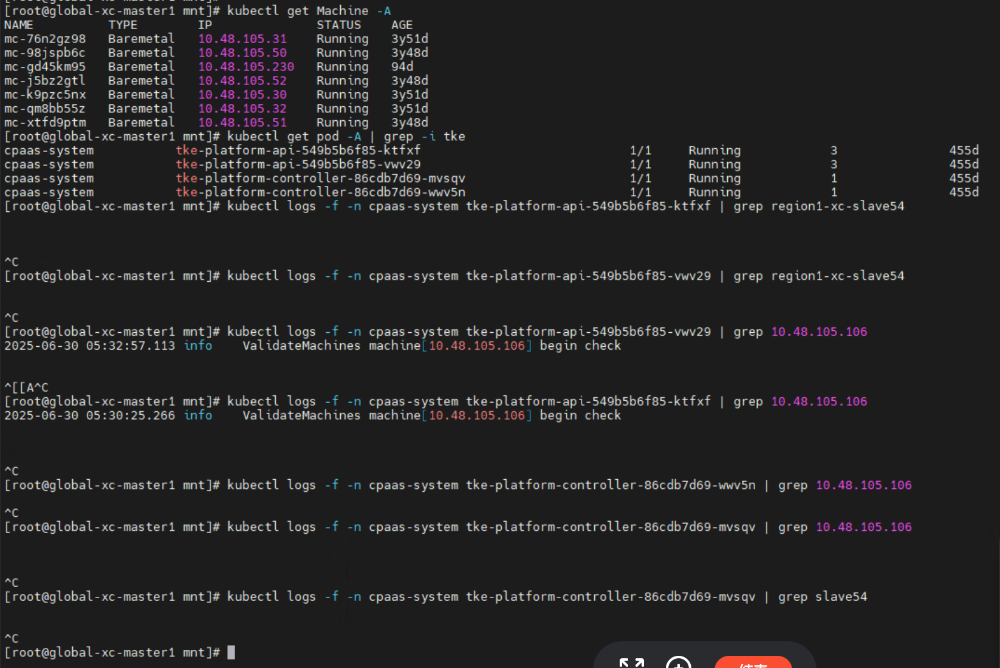
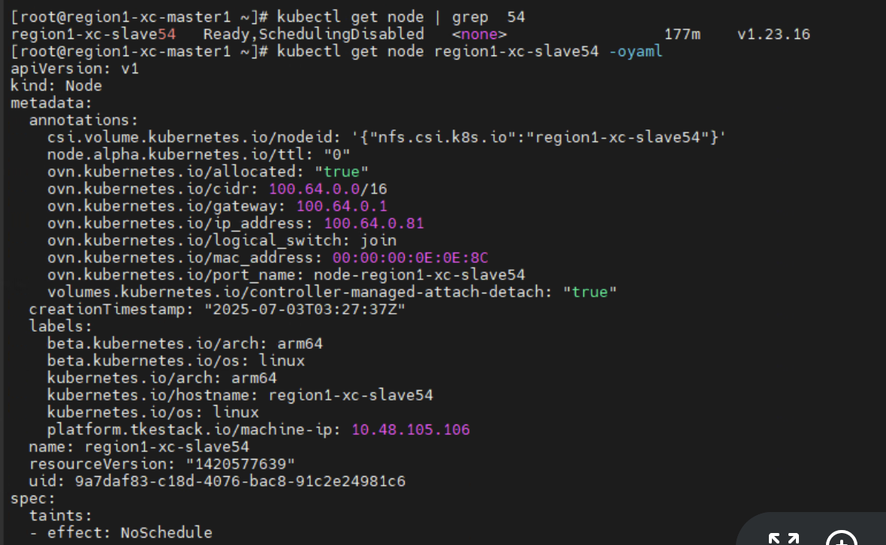
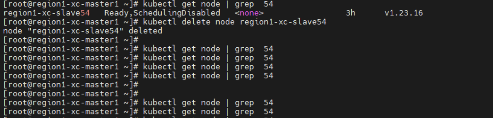

---
kind:
  - Troubleshooting
products:
  - Alauda Container Platform
  - Alauda DevOps
  - Alauda AI
  - Alauda Application Services
  - Alauda Service Mesh
  - Alauda Developer Portal
ProductsVersion:
  - 4.1.0,4.2.x
---
<!-- A type of document that involves encountering a fault, diagnosing it, performing root cause analysis, and providing solutions. -->

# 删除节点后过一会集群里还会出现这个节点

删除节点后集群中仍出现该节点 节点虚拟机IP已变更并用于其他业务 节点无法ping通但K8S状态为Running

## Cause

## Resolution
- 手动执行kubectl delete node命令观察节点是否重新出现

## [workaround]

## [Related Information]
**Screenshots**

- Environment: TKE 3.12.1
- global集群
- machine资源
- tke组件
- Component: Kubernetes
- Page ID: 330465842
- Original Title: 基础架构-产品生命周期管理-删除节点后过一会集群里还会出现这个节点-112186
