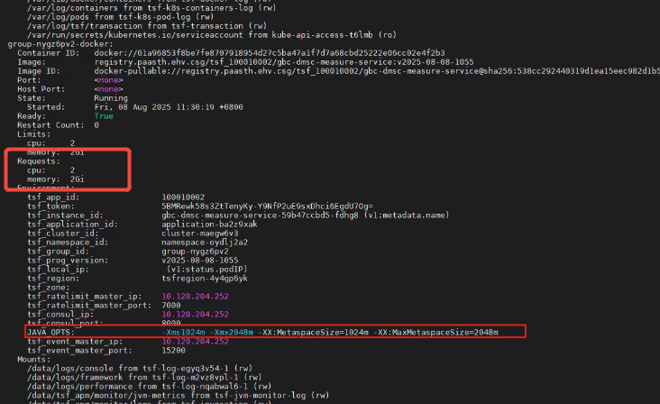

---
kind:
  - Troubleshooting
products:
  - Alauda Container Platform
  - Alauda DevOps
  - Alauda AI
  - Alauda Application Services
  - Alauda Service Mesh
  - Alauda Developer Portal
ProductsVersion:
  - 4.1.0,4.2.x
---
<!-- A type of document that involves encountering a fault, diagnosing it, performing root cause analysis, and providing solutions. -->

# node描述的cpu和request值过大且相等，不受deployment资源限制

请求值（requests）：容器创建时请求占用的资源量。Kubernetes 进行容器调度时，将根据该值进行判断，会把容器调度到资源可用量满足容器请求值的节点上运行；如果没有满足要求的节点（例如：当请求值大于可调度的节点上的资源可用量时），容器将无法正常启动。

## Cause
- 发现应用会关联tsf启动一个请求值为1c2g或2c2g的容器，这里的request值过大会导致浪费节点资源。

## Resolution
- 麻烦看下pod的yaml中的资源配置，并确认下这个应用除了受deploy管理外是否还受其他资源管理。另外需要确认下集群或者项目和命名空间是否有超售比。
- 该问题沟通明天处理。
- 沟通明日排查
- 限制值（limits）：容器运行时可以使用的最大资源量，容器运行过程中，资源占用量不可超过该值。
- ## 解决方案

## [workaround]

## [Related Information]
**Screenshots**

- 2597
- 2598
- 2588
- 10
- /rong-qi-ping-tai-qi-ta-nodemiao-shu-de-cpuhe-requestzhi-guo-da-qie-xiang-deng-bu/1754639528_99781_2e9cc3_
- /rong-qi-ping-tai-qi-ta-nodemiao-shu-de-cpuhe-requestzhi-guo-da-qie-xiang-deng-bu/1754639528_99781_bbe095_
- /rong-qi-ping-tai-qi-ta-nodemiao-shu-de-cpuhe-requestzhi-guo-da-qie-xiang-deng-bu/1754639528_99781_a9457a_
- /rong-qi-ping-tai-qi-ta-nodemiao-shu-de-cpuhe-requestzhi-guo-da-qie-xiang-deng-bu/1754639528_99781_306465_
- /rong-qi-ping-tai-qi-ta-nodemiao-shu-de-cpuhe-requestzhi-guo-da-qie-xiang-deng-bu/1754639528_99781_8feca8_
- /rong-qi-ping-tai-qi-ta-nodemiao-shu-de-cpuhe-requestzhi-guo-da-qie-xiang-deng-bu/1754639528_99781_fc0ac9_
- Component: Kubernetes
- Page ID: 330465870
- Original Title: 容器平台-其他-node描述的cpu和request值过大且相等，不受deployment资源限制-114754
