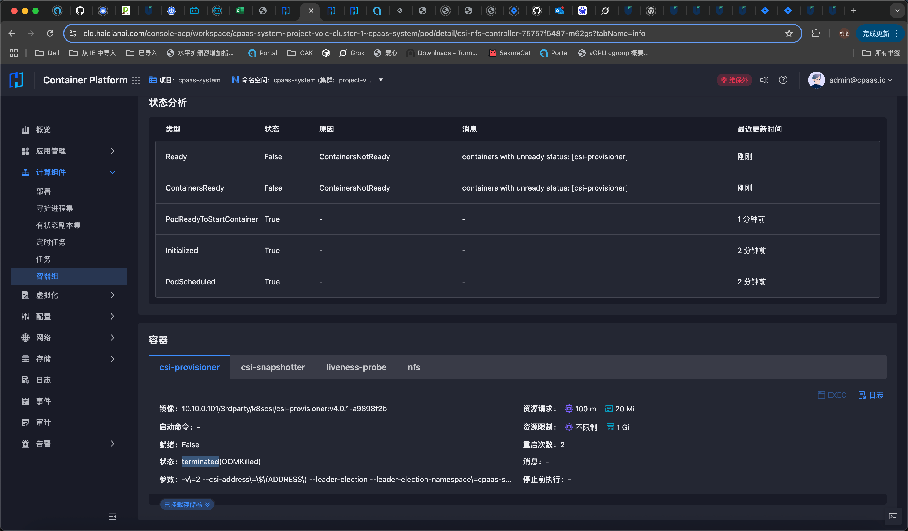
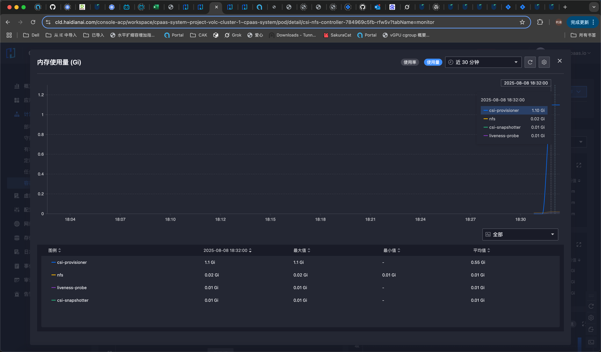

---
kind:
  - Troubleshooting
products:
  - Alauda Container Platform
  - Alauda DevOps
  - Alauda AI
  - Alauda Application Services
  - Alauda Service Mesh
  - Alauda Developer Portal
ProductsVersion:
  - 4.1.0,4.2.x
---
<!-- A type of document that involves encountering a fault, diagnosing it, performing root cause analysis, and providing solutions. -->

# 无法创建nas存储pvc

无法创建NAS PVC PVC报错：ExternalProvisioning: Waiting for a volume to be created either by the external provisioner 'nfs.csi.k8s.io' csi-provisioner组件出现OOM（内存不足）错误

## Cause
- csi-provisioner组件内存不足（原配置1G）导致OOM

## Resolution
- 调整csi-provisioner内存配置从1G提高到2G

## [workaround]

## [Related Information]
**Screenshots**

- Environment: 3.18.1
- nfs.csi.k8s.io
- csi-nfs-controller
- csi-provisioner
- StorageClass(SC)
- PVC/PV
- Component: Kubernetes
- Page ID: 330466257
- Original Title: 容器平台-存储-nfs存储-无法创建nas存储pvc-114778
