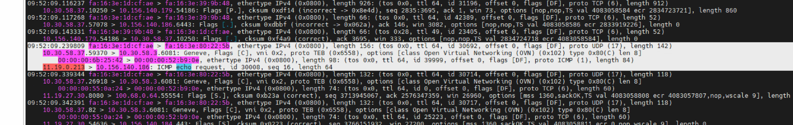
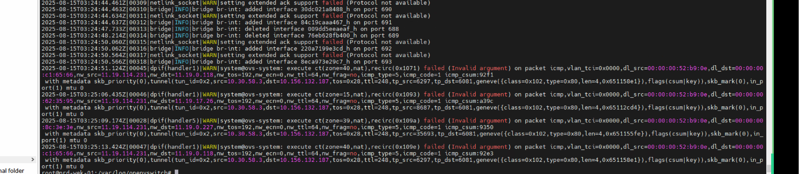
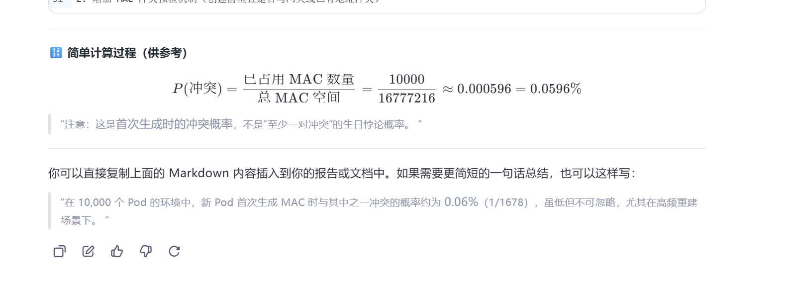

---
kind:
  - Troubleshooting
products:
  - Alauda Container Platform
  - Alauda DevOps
  - Alauda AI
  - Alauda Application Services
  - Alauda Service Mesh
  - Alauda Developer Portal
ProductsVersion:
  - 4.1.0,4.2.x
---
<!-- A type of document that involves encountering a fault, diagnosing it, performing root cause analysis, and providing solutions. -->

# 中化集群网关mac冲突导致子网内流量异常

大部分Pod无法访问Service和节点网络，但Pod CIDR正常 ovs-vswitchd.log中出现大量ICMP重定向报文 流量外层封包被错误封装为普通节点IP

## Cause
- topolvm-vg-prepare Pod的MAC地址与子网网关MAC地址冲突

## Resolution
- 实施MAC地址扩容方案（新版本已支持）
- 在Pod创建时增加MAC地址冲突检查

## [workaround]
- 重置集群数据库恢复环境

## [Related Information]
**Screenshots**

- Environment: ACP 3.14.1
- 6443端口
- ovs-vswitchd.log
- kube-ovn-controller
- topolvm-vg-prepare Pod
- 子网网关MAC地址
- Component: Kubernetes
- Page ID: 332038329
- Original Title: 中化集群网关mac冲突导致子网内流量异常
