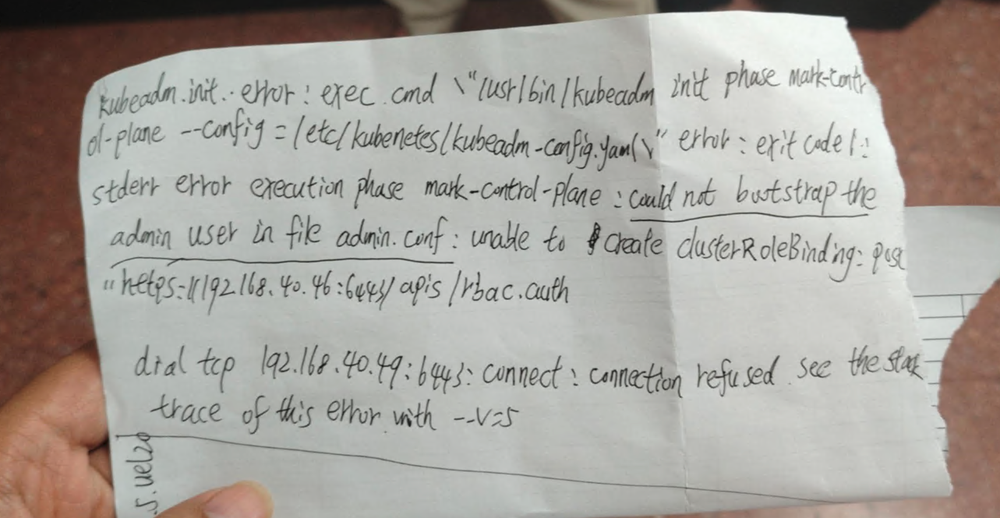
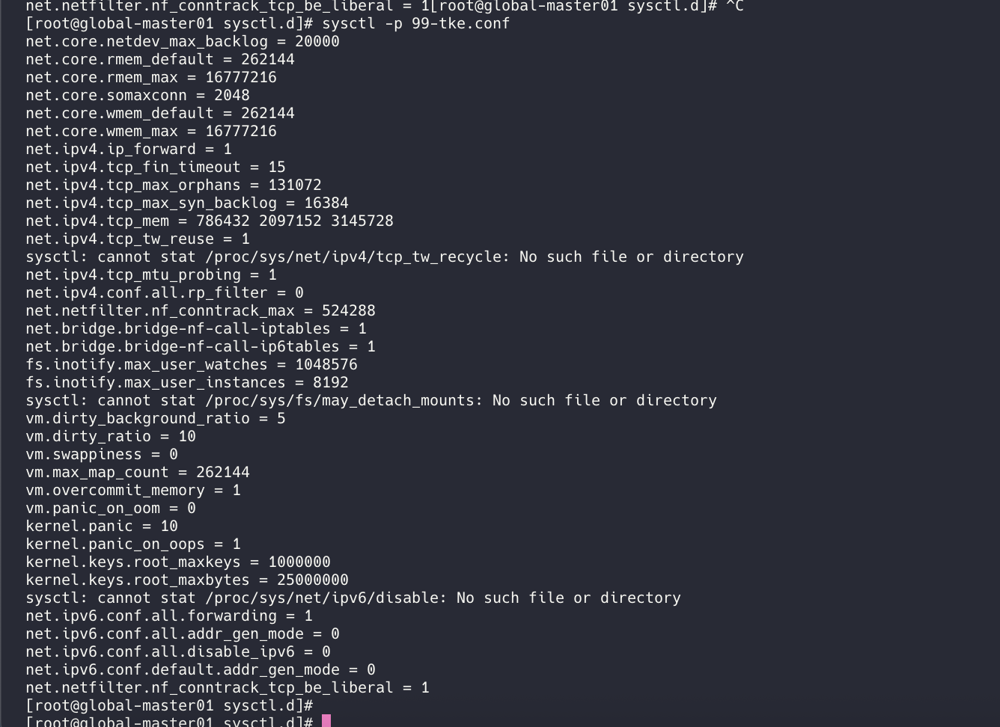

---
kind:
  - Troubleshooting
products:
  - Alauda Container Platform
  - Alauda DevOps
  - Alauda AI
  - Alauda Application Services
  - Alauda Service Mesh
  - Alauda Developer Portal
ProductsVersion:
  - 4.1.0,4.2.x
---
<!-- A type of document that involves encountering a fault, diagnosing it, performing root cause analysis, and providing solutions. -->

# uos系统

部署集群卡在k8s阶段 报错admin.conf文件问题 kubeadm init阶段6443端口TLS握手失败

## Cause
- UOS系统内核参数缺失导致sysctl -p加载失败
- /etc/sysctl.d/99-tke.conf中的内核参数未生效

## Resolution
- 手动执行sysctl -p /etc/sysctl.d/99-tke.conf -e加载内核参数

## [workaround]

## [Related Information]
**Screenshots**

- Environment: 统信V20军用版，K8S版本4.0.3，自建VIP，runc/containerd标准版本
- 6443端口
- /etc/kubernetes/kubeadm-config.yaml
- /var/lib/kubelet/config.yaml
- kubeadm
- kubelet
- containerd
- sysctl配置
- Component: Kubernetes
- Page ID: 333316791
- Original Title: 基础架构-uos系统-部署集群卡住-115123
