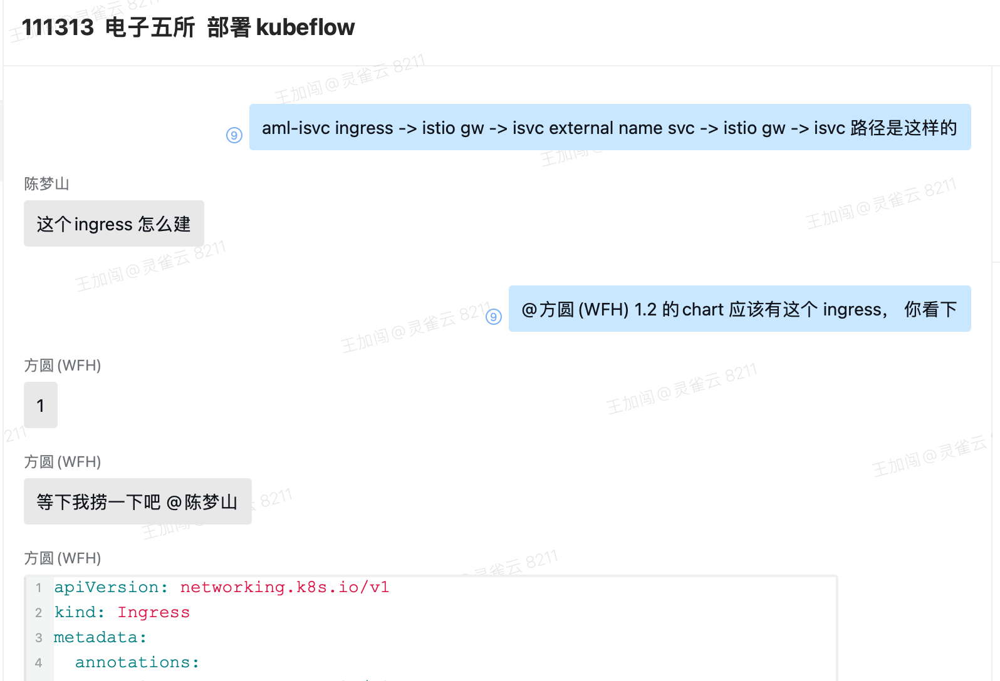

---
kind:
  - Troubleshooting
products:
  - Alauda Container Platform
  - Alauda DevOps
  - Alauda AI
  - Alauda Application Services
  - Alauda Service Mesh
  - Alauda Developer Portal
ProductsVersion:
  - 4.1.0,4.2.x
---
<!-- A type of document that involves encountering a fault, diagnosing it, performing root cause analysis, and providing solutions. -->

# aml 1.3  推服务集群外访问失败

集群外访问失败 1.2 的 Ingress 配置在 1.3 中不存在

## Cause
- AML 1.3 移除了原有的 Ingress 配置
- 未采用新的外部访问方案

## Resolution
- 参考文档 https://docs-dev.alauda.cn/ai/main/model_inference/inference_service/how_to/external_access_inference_service.html 配置新方案

## [workaround]

## [Related Information]
**Screenshots**

- Environment: AML 1.3
- ingress
- knative-local-gateway
- alb.ingress.kubernetes.io/listen-ports
- alb.ingress.kubernetes.io/scheme
- alb.ingress.kubernetes.io/target-type
- Component: Kubernetes
- Page ID: 334791286
- Original Title: aml 1.3  推服务集群外访问失败
