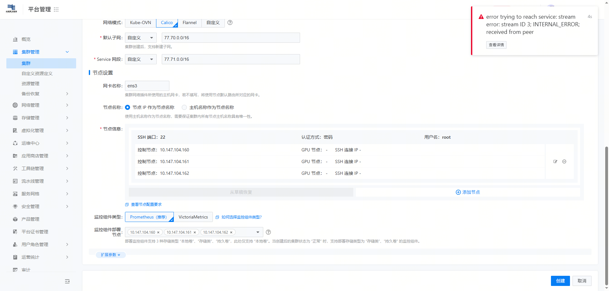

---
kind:
  - Troubleshooting
products:
  - Alauda Container Platform
  - Alauda DevOps
  - Alauda AI
  - Alauda Application Services
  - Alauda Service Mesh
  - Alauda Developer Portal
ProductsVersion:
  - 4.1.0,4.2.x
---
<!-- A type of document that involves encountering a fault, diagnosing it, performing root cause analysis, and providing solutions. -->

# TKE创建新集群失败

页面报错 error trying to reach service: stream error: stream ID 13; INTERNAL_ERROR; received from peer 添加节点失败

## Cause
- api-server 的证书过期需要更新

## Resolution
- 更新 api-server 证书后重启其 pod 同步信息

## [workaround]

## [Related Information]
**Screenshots**

- Environment: 3.10.2
- tke-platform-api
- api-server
- k8s 基础组件
- Component: Kubernetes
- Page ID: 339443720
- Original Title: 基础架构-产品生命周期管理-部署-TKE创建新集群失败-114502
