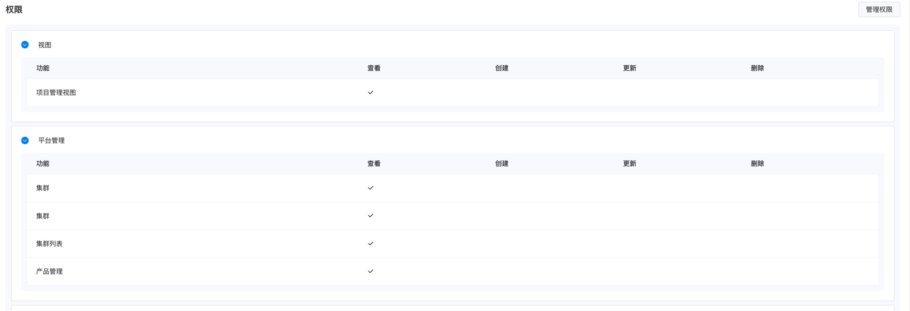
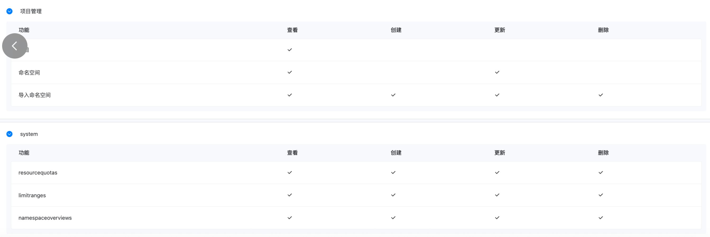

---
kind:
  - Troubleshooting
products:
  - Alauda Container Platform
  - Alauda DevOps
  - Alauda AI
  - Alauda Application Services
  - Alauda Service Mesh
  - Alauda Developer Portal
ProductsVersion:
  - 4.1.0,4.2.x
---
<!-- A type of document that involves encountering a fault, diagnosing it, performing root cause analysis, and providing solutions. -->

# 关于拥有导入命名空间最小权限的角色配置

JIRA Jira：

## Cause

## Resolution
- 使用PATCH方法调用API：/kubernetes/${CLUSTER_NAME}/api/v1/namespaces/${NAMESPACE}，携带{"metadata":{"labels":{"cpaas.io/project":"${PROJECT_NAME}"}}}请求体
- 通过平台管理员复制角色进行改造，添加命名空间patch权限及相关自定义权限(具体配置需参考截图)

## [workaround]

## [Related Information]
**Screenshots**

- Environment: 4.0.2
- /kubernetes/${CLUSTER_NAME}/api/v1/namespaces/${NAMESPACE}
- cpaas.io/project
- APIToken
- PROJECT_NAME
- PLATFORM_ADDRESS
- CLUSTER_NAME
- NAMESPACE
- Component: Kubernetes
- Page ID: 345538885
- Original Title: 基础架构-关于拥有导入命名空间最小权限的角色配置
