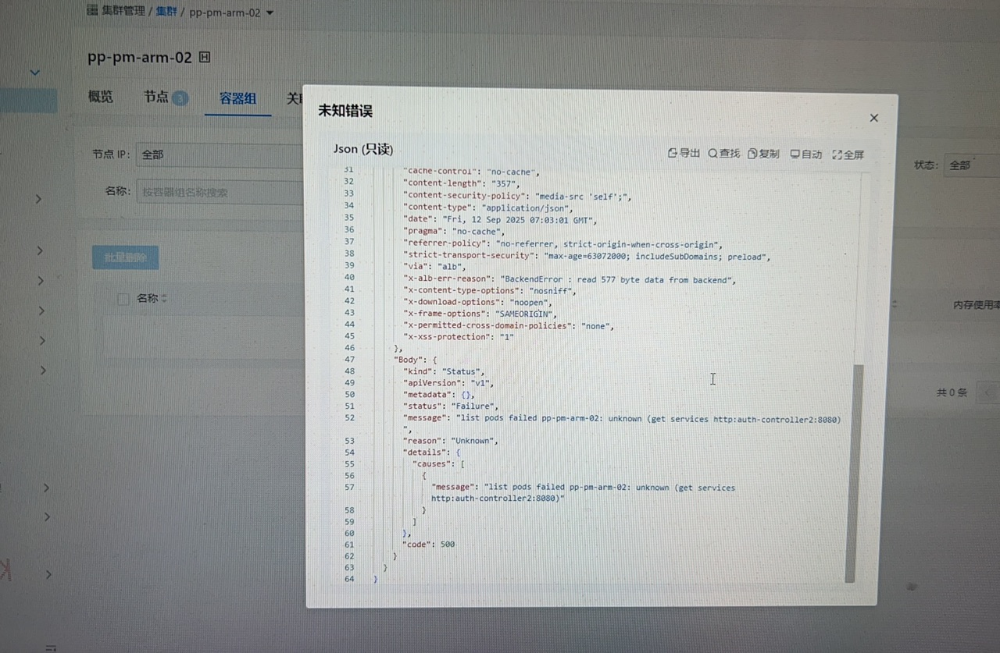
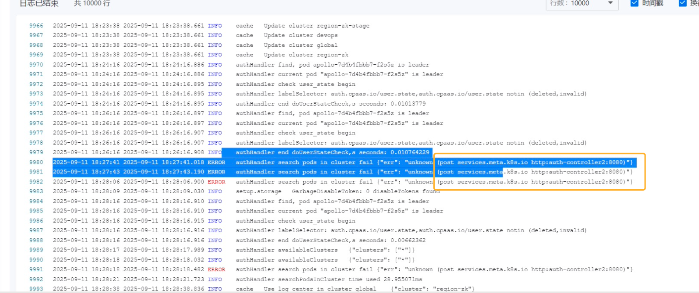

---
kind:
  - Troubleshooting
products:
  - Alauda Container Platform
  - Alauda DevOps
  - Alauda AI
  - Alauda Application Services
  - Alauda Service Mesh
  - Alauda Developer Portal
ProductsVersion:
  - 4.1.0,4.2.x
---
<!-- A type of document that involves encountering a fault, diagnosing it, performing root cause analysis, and providing solutions. -->

# 平台新部署的业务集群，在查看容器组时提示未知错误

查看容器组时提示未知错误-117502 Apollo日志显示访问了错误的资源（如meta.k8s.io）

## Cause
- client缓存和schema初始化顺序问题导致访问错误的GVK

## Resolution
- 重启Apollo服务

## [workaround]

## [Related Information]
**Screenshots**

- Environment: 4.0.3
- apollo
- meta.k8s.io
- Component: Kubernetes
- Page ID: 345538893
- Original Title: 基础架构-平台新部署的业务集群，在查看容器组时提示未知错误-117502
