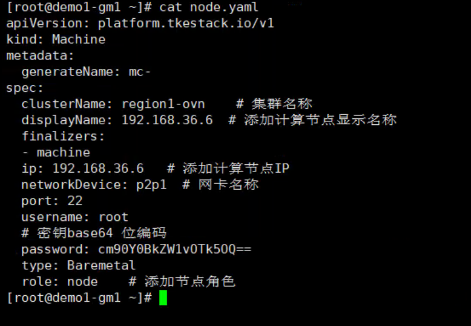

---
kind:
  - Troubleshooting
products:
  - Alauda Container Platform
  - Alauda DevOps
  - Alauda AI
  - Alauda Application Services
  - Alauda Service Mesh
  - Alauda Developer Portal
ProductsVersion:
  - 4.1.0,4.2.x
---
<!-- A type of document that involves encountering a fault, diagnosing it, performing root cause analysis, and providing solutions. -->

# 业务集群添加计算节点主机网卡不一致导致无法页面添加

业务集群添加计算节点异常，报错无法使用非eth0的网卡

## Cause
- 计算节点主机网卡名称不一致（如使用p2p1而非eth0）

## Resolution
- 在管理集群master节点手动创建Machine资源，指定正确网卡名称

## [workaround]

## [Related Information]
**Screenshots**

- Environment: 3.6版本ovn业务集群
- metadata.clusterName
- spec.networkDevice
- spec.ip
- spec.role
- Machine资源
- Component: Node
- Page ID: 101651519
- Original Title: 基础架构-业务集群添加计算节点主机网卡不一致导致无法页面添加
