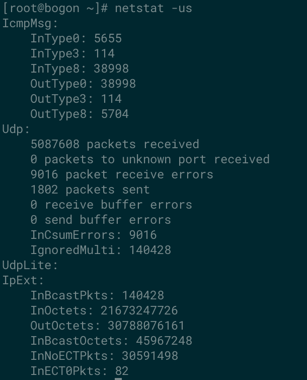

---
kind:
  - Troubleshooting
products:
  - Alauda Container Platform
  - Alauda DevOps
  - Alauda AI
  - Alauda Application Services
  - Alauda Service Mesh
  - Alauda Developer Portal
ProductsVersion:
  - 4.1.0,4.2.x
---
<!-- A type of document that involves encountering a fault, diagnosing it, performing root cause analysis, and providing solutions. -->

# node 可以 ping 通跨节点 pod，curl 超时

node 上跨节点 pod ping 通但 curl 超时 netstat -us 显示 InCsumErrors 持续上涨

## Cause
- 系统内核(4.19.90-25.9.v2101.ky10.aarch64)与 Huawei HNS 网卡驱动配合问题导致 offload 后 csum 计算错误

## Resolution
- 关闭物理网卡 tx offload: ethtool -K enp125s0f0 tx off

## [workaround]
- 临时关闭 tx offload 但会导致 TCP 吞吐量下降，需与客户沟通确认

## [Related Information]
**Screenshots**

- Environment: Kernel 4.19.90-25.9.v2101.ky10.aarch64 + Huawei HNS GE/10GE/25GE Network Controller
- enp125s0f0
- ethtool -K
- InCsumErrors
- HNS GE/10GE/25GE Network Controller
- Component: Node
- Page ID: 112040489
- Original Title: node 可以 ping 通跨节点 pod，curl 超时
