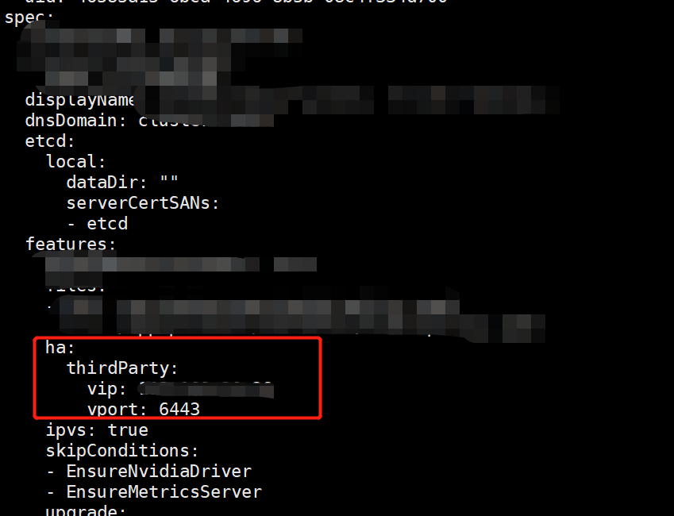

---
kind:
  - Troubleshooting
products:
  - Alauda Container Platform
  - Alauda DevOps
  - Alauda AI
  - Alauda Application Services
  - Alauda Service Mesh
  - Alauda Developer Portal
ProductsVersion:
  - 4.1.0,4.2.x
---
<!-- A type of document that involves encountering a fault, diagnosing it, performing root cause analysis, and providing solutions. -->

# 纳管业务集群无法添加节点

新增节点检查超时 tke-platform-api组件异常重启 panic: runtime error: invalid memory address or nil pointer dereference

## Cause
- 纳管的2.9版本业务集群在global集群cluster资源中缺少spec.features.ha字段

## Resolution
- 编辑问题集群配置添加ha字段：kubectl edit cluster <region-name>
- 添加spec.features.ha配置段并设置vip/vport参数

## [workaround]

## [Related Information]
**Screenshots**

- Environment: 3.6及以上版本
- tke-platform-api
- cluster.spec.features.ha
- 6443端口
- 集群API地址
- Component: Node
- Page ID: 115514678
- Original Title: 纳管业务集群无法添加节点
