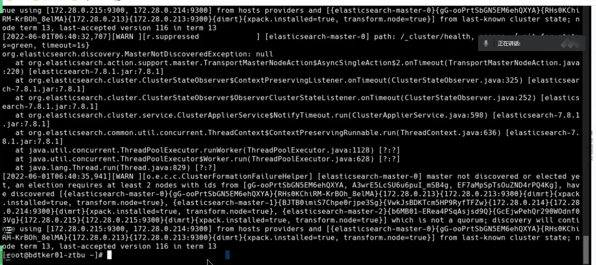
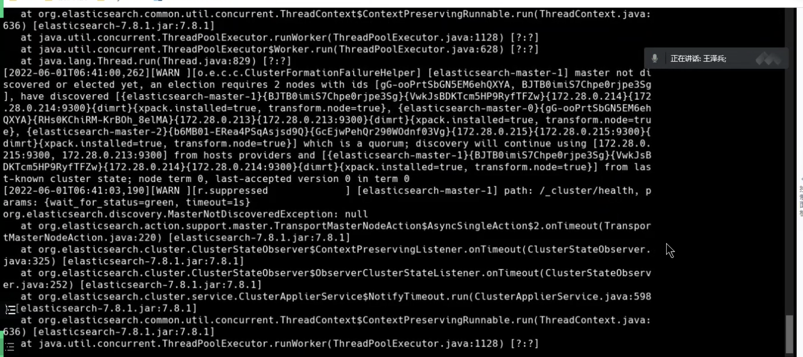

---
kind:
  - Troubleshooting
products:
  - Alauda Container Platform
  - Alauda DevOps
  - Alauda AI
  - Alauda Application Services
  - Alauda Service Mesh
  - Alauda Developer Portal
ProductsVersion:
  - 4.1.0,4.2.x
---
<!-- A type of document that involves encountering a fault, diagnosing it, performing root cause analysis, and providing solutions. -->

# 应用目录部署的es重启后无法正常启动

es容器状态0/1 健康检查返回503错误 日志显示选主失败

## Cause
- 2、3节点持久化数据丢失
- 新节点uid与原有节点1存储的uid不一致
- 过半数据丢失且无备份

## Resolution
- 清理节点1的持久化数据
- 重启节点1容器

## [workaround]

## [Related Information]
**Screenshots**

- Environment: 3.6.x
- _cluster/health
- topolvm
- elasticsearch节点uid
- Component: Node
- Page ID: 115528215
- Original Title: 应用目录部署的es重启后无法正常启动
