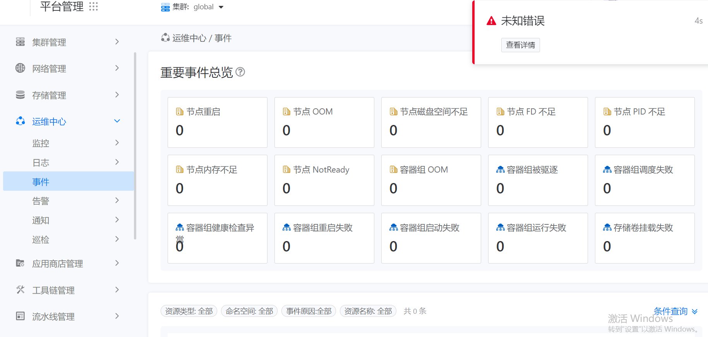
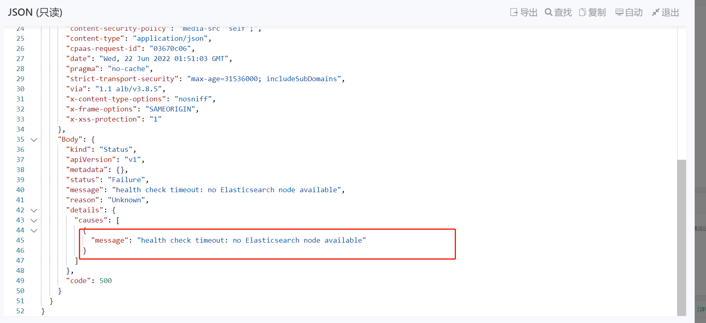
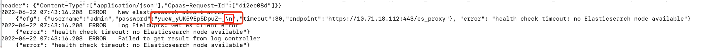
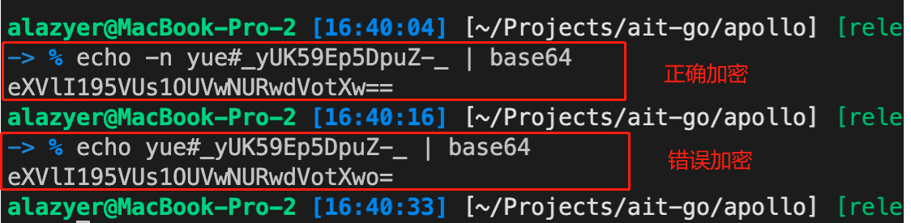

---
kind:
  - Troubleshooting
products:
  - Alauda Container Platform
  - Alauda DevOps
  - Alauda AI
  - Alauda Application Services
  - Alauda Service Mesh
  - Alauda Developer Portal
ProductsVersion:
  - 4.1.0,4.2.x
---
<!-- A type of document that involves encountering a fault, diagnosing it, performing root cause analysis, and providing solutions. -->

# 界面报错未知错误

界面报错未知错误 health check timeout: no Elasticsearch node available

## Cause
- 密码加密方式错误

## Resolution
- 使用正确方式加密ES密码: echo -n es密码 |base64
- 更新 acp-config-secret 的 ES_PASSWORD 字段
- 更新 elasticsearch-basic-auth 的 password 字段
- 重启apollo服务并清理浏览器缓存

## [workaround]

## [Related Information]
**Screenshots**

- Environment: Jira 3.8.1（从3.4.1升级），曾修改过ES配置
- acp-config-secret
- elasticsearch-basic-auth
- ES_PASSWORD
- password
- apollo
- Component: Node
- Page ID: 119079891
- Original Title: 界面报错未知错误-查看详细信息报错health check timeout: no Elasticsearch node available
