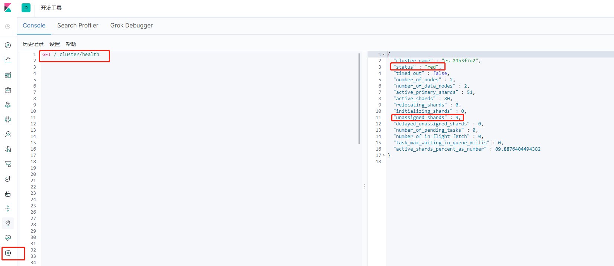
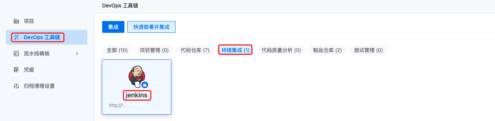
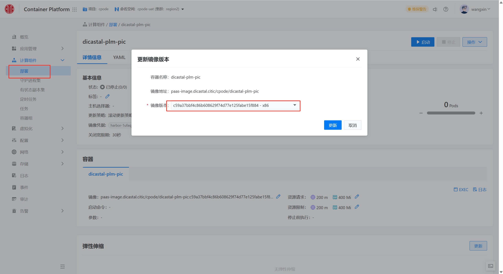

---
kind:
  - Troubleshooting
products:
  - Alauda Container Platform
  - Alauda DevOps
  - Alauda AI
  - Alauda Application Services
  - Alauda Service Mesh
  - Alauda Developer Portal
ProductsVersion:
  - 4.1.0,4.2.x
---
<!-- A type of document that involves encountering a fault, diagnosing it, performing root cause analysis, and providing solutions. -->

# Elasticsearch集群异常状态（RED、YELLOW）原因分析

集群状态显示为RED（存在不可用主分片）或YELLOW（副本分片未分配） 存在未分配分片（unassigned_shards） RED状态影响索引操作，YELLOW状态仅弱化高可用性

## Cause
- 节点离开集群（NODE_LEFT）导致分片未分配
- 主分片数据完全丢失（如单副本集群节点永久故障）
- 副本分片分配失败（ALLOCATION_FAILED）

## Resolution
- 等待离线节点恢复并重新加入集群
- 使用reroute命令强制分配空主分片：POST /_cluster/reroute
- 调整分片分配策略或增加节点

## [workaround]

## [Related Information]
**Screenshots**

- Environment: Elasticsearch 通用版本
- /_cluster/health
- /_cat/indices
- /_cluster/allocation/explain
- cluster.reroute
- unassigned_shards
- Component: Node
- Page ID: 119087954
- Original Title: Elasticsearch集群异常状态（RED、YELLOW）原因分析
