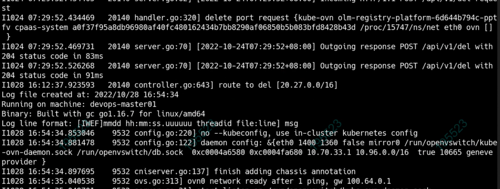
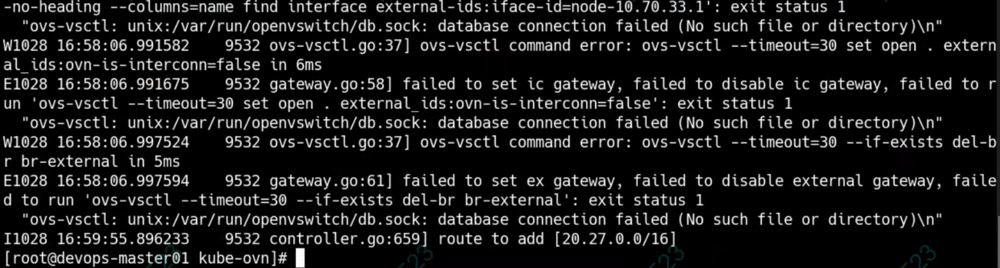
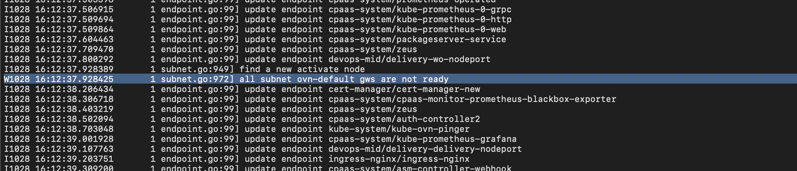

---
kind:
  - Troubleshooting
products:
  - Alauda Container Platform
  - Alauda DevOps
  - Alauda AI
  - Alauda Application Services
  - Alauda Service Mesh
  - Alauda Developer Portal
ProductsVersion:
  - 4.1.0,4.2.x
---
<!-- A type of document that involves encountering a fault, diagnosing it, performing root cause analysis, and providing solutions. -->

# node 和 pod 连接中断

node 和 pod 不通 node 到其他 node 和本 node 的 ovn0 正常 CNI 节点日志显示路由丢失记录

## Cause
- 已知 bug: node not ready 时 subnet status 被置为 notready 触发路由删除

## Resolution
- 升级 CNI 到 1.8.11 版本 (该问题在 1.8.9 已解决)

## [workaround]

## [Related Information]
**Screenshots**

- Environment: CNI 1.8.3
- ovn0
- subnet.status
- pod CIDR
- node status
- Component: Node
- Page ID: 127432760
- Original Title: node 和 pod 连接中断
