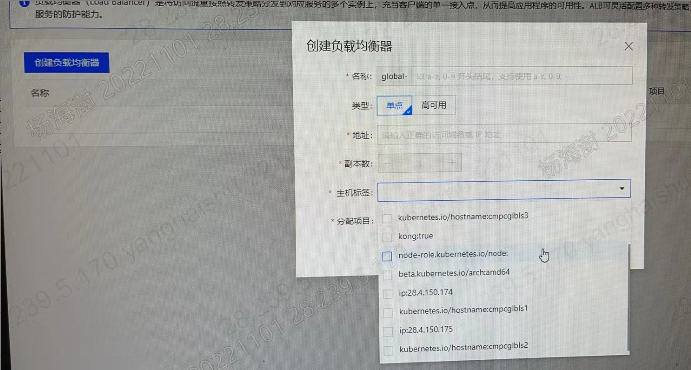

---
kind:
  - Troubleshooting
products:
  - Alauda Container Platform
  - Alauda DevOps
  - Alauda AI
  - Alauda Application Services
  - Alauda Service Mesh
  - Alauda Developer Portal
ProductsVersion:
  - 4.1.0,4.2.x
---
<!-- A type of document that involves encountering a fault, diagnosing it, performing root cause analysis, and providing solutions. -->

# 2.6

创建负载均衡器页面中主机标签下拉菜单显示不全，部分节点标签缺失

## Cause
- 存在污点（taint）的节点标签不会在ALB创建页面显示（前端设计限制）

## Resolution
- 需通过前端设计修复该显示逻辑问题

## [workaround]

## [Related Information]
**Screenshots**

- Environment: ACP 2.6
- node label
- taint
- alb创建页面
- furion
- metis
- cpaas
- Component: Node
- Page ID: 133086193
- Original Title: 2.6-创建负载均衡器页面选不到node标签
