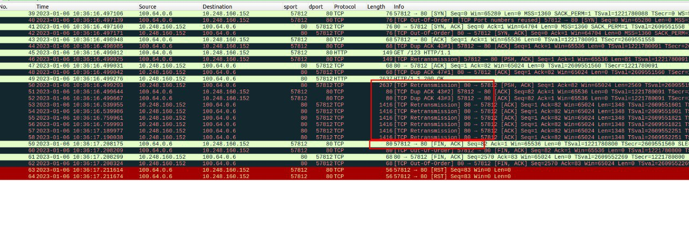
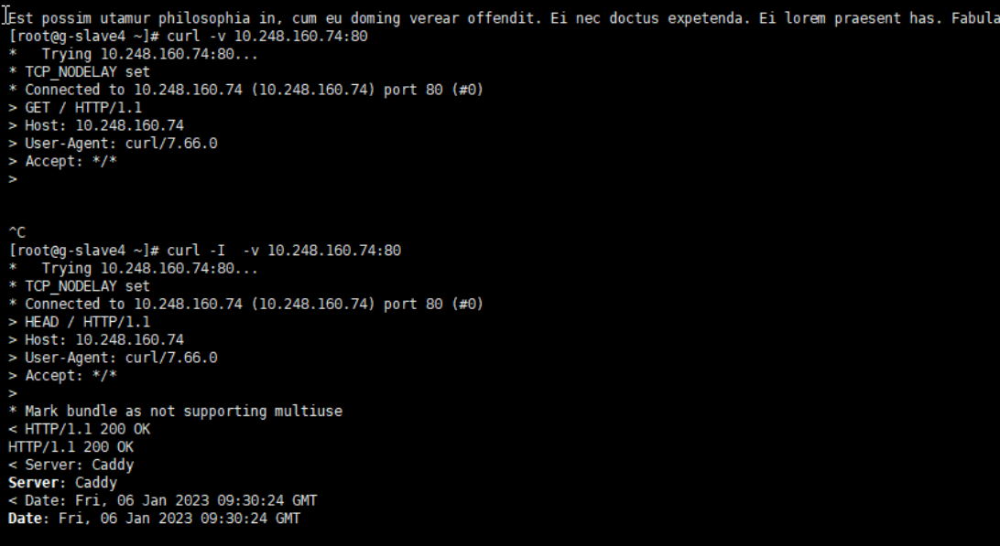
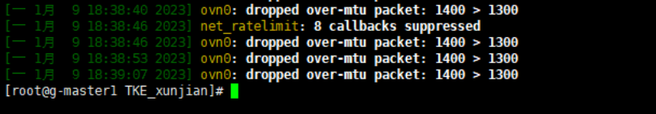
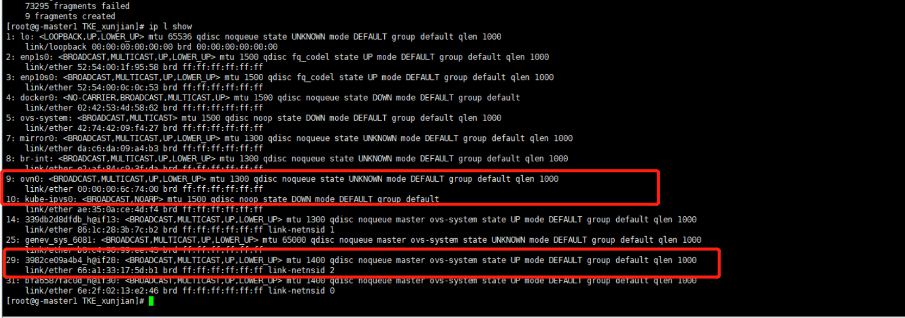
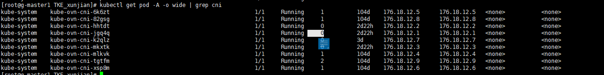
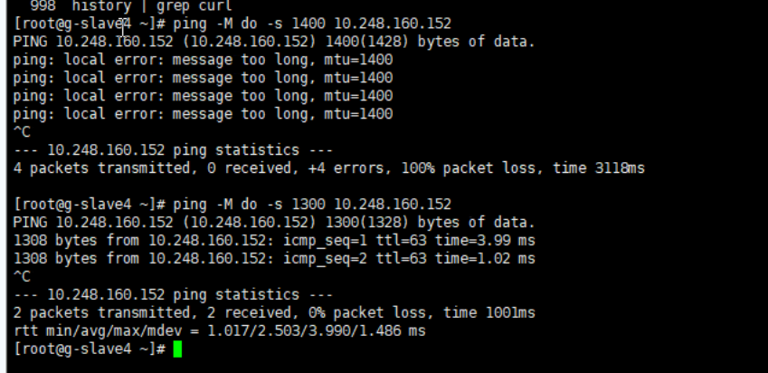
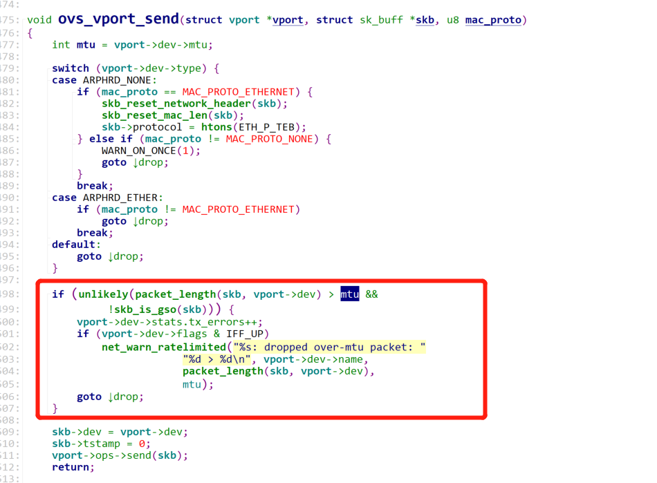

---
kind:
  - Troubleshooting
products:
  - Alauda Container Platform
  - Alauda DevOps
  - Alauda AI
  - Alauda Application Services
  - Alauda Service Mesh
  - Alauda Developer Portal
ProductsVersion:
  - 4.1.0,4.2.x
---
<!-- A type of document that involves encountering a fault, diagnosing it, performing root cause analysis, and providing solutions. -->

# 从node到pod由于mtu分片丢包问题排查

节点curl特定Pod不通，但nc、telnet、ping正常，该节点访问其他Pod正常 抓包显示Pod返回200但持续重传 dmesg -T显示MTU丢包日志

## Cause
- 物理网卡MTU修改后，未重启的kube-ovn-cni仍按旧MTU计算ovn0和容器MTU
- Geneve封装导致额外包头开销（IP+UDP+Geneve=44字节），超出中间链路MTU限制

## Resolution
- 将物理网卡MTU改回1400并重启所有kube-ovn-cni Pod
- 使用命令 `ovs-vsctl set interface ovn0 mtu_request=1400` 手动配置ovn0 MTU
- 检查中间链路（如交换机、OpenStack OVN）MTU配置，确保虚机MTU ≤1442

## [workaround]
- 临时调整Node MTU至1400以适配Geneve封装开销

## [Related Information]
**Screenshots**

- Environment: arm 麒麟, CNI 1.8
- ovn0
- kube-ovn-cni
- 物理网卡mtu
- geneve封装
- dmesg日志
- ovs-vsctl
- Component: Node
- Page ID: 133102641
- Original Title: 从node到pod由于mtu分片丢包问题排查
