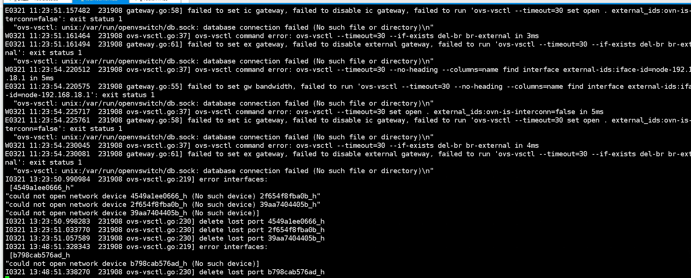
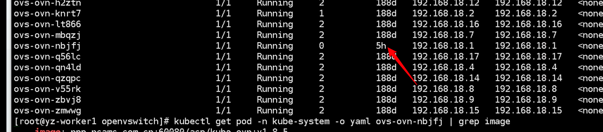
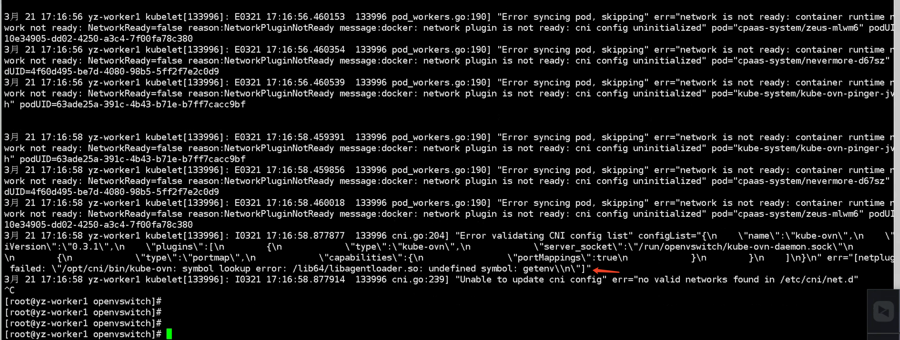
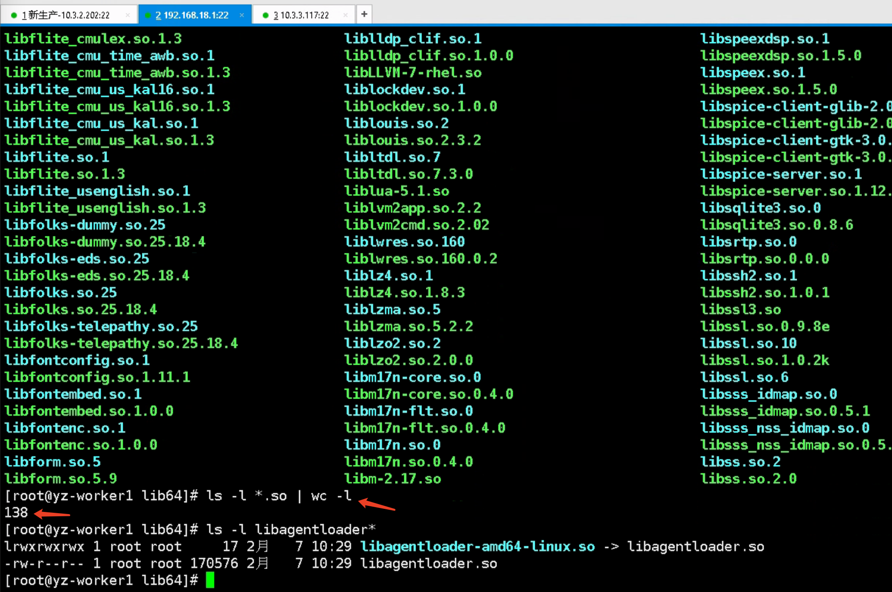
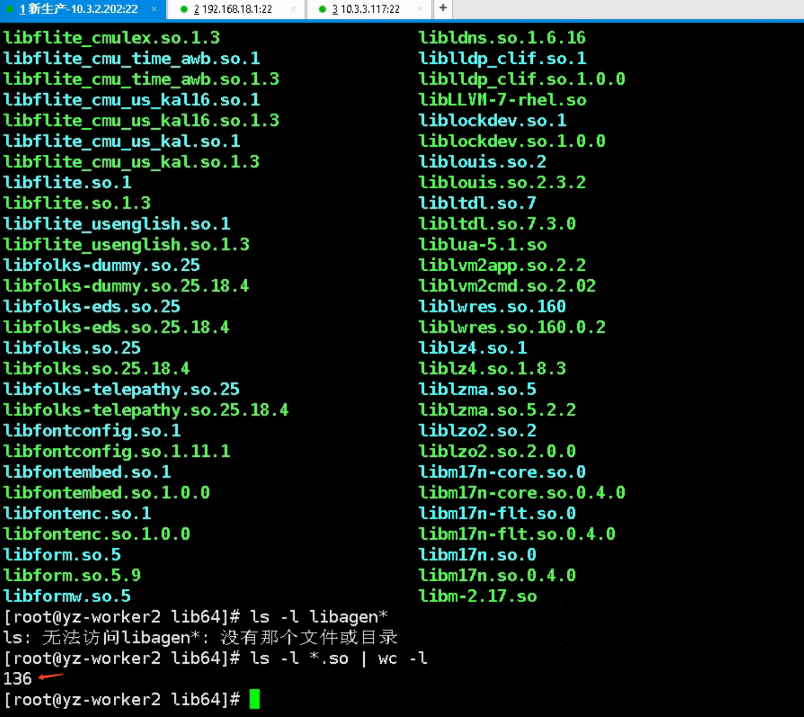

---
kind:
  - Troubleshooting
products:
  - Alauda Container Platform
  - Alauda DevOps
  - Alauda AI
  - Alauda Application Services
  - Alauda Service Mesh
  - Alauda Developer Portal
ProductsVersion:
  - 4.1.0,4.2.x
---
<!-- A type of document that involves encountering a fault, diagnosing it, performing root cause analysis, and providing solutions. -->

# 新华资产，某个node异常，cni pod 报错

ovs-ovn 和 kube-ovn-cni pod 有重启记录 kubelet log 存在异常报错 节点 so 文件存在差异

## Cause
- so 文件不一致或损坏

## Resolution
- 删除异常 so 文件

## [workaround]

## [Related Information]
**Screenshots**

- kube-ovn-cni
- ovs-ovn
- kubelet log
- so 文件
- Component: Node
- Page ID: 140822526
- Original Title: 新华资产，某个node异常，cni pod 报错
