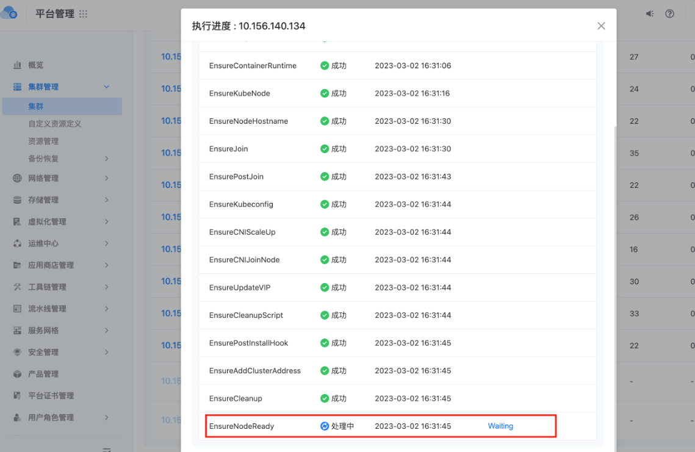

---
kind:
  - Troubleshooting
products:
  - Alauda Container Platform
  - Alauda DevOps
  - Alauda AI
  - Alauda Application Services
  - Alauda Service Mesh
  - Alauda Developer Portal
ProductsVersion:
  - 4.1.0,4.2.x
---
<!-- A type of document that involves encountering a fault, diagnosing it, performing root cause analysis, and providing solutions. -->

# 业务集群添加节点卡在EnsureNodeReady状态

节点状态为NotReady ovn-cni容器状态CrashBackOff

## Cause
- 新节点与已有节点处于不同网段
- 防火墙限制导致新节点无法访问master节点的6641-6644端口

## Resolution
- 放开新节点与master节点间6641-6644端口的网络访问权限

## [workaround]

## [Related Information]
**Screenshots**

- Environment: 3.8.1
- Kube-OVN
- ovn-cni
- 6641-6644端口
- 节点网段配置
- Component: Node
- Page ID: 140824233
- Original Title: 业务集群添加节点卡在EnsureNodeReady状态
