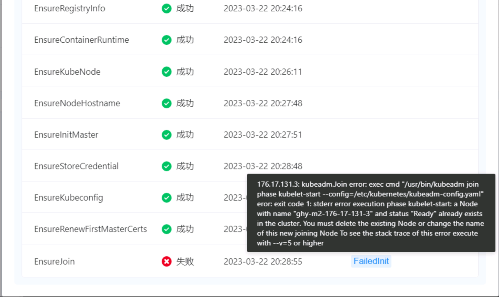

---
kind:
  - Troubleshooting
products:
  - Alauda Container Platform
  - Alauda DevOps
  - Alauda AI
  - Alauda Application Services
  - Alauda Service Mesh
  - Alauda Developer Portal
ProductsVersion:
  - 4.1.0,4.2.x
---
<!-- A type of document that involves encountering a fault, diagnosing it, performing root cause analysis, and providing solutions. -->

# 创建集群失败

创建集群卡在ensurejoin步骤 报错a Node with name "<node_name>" and status "Ready" already exists in the cluster

## Cause
- 已知bug导致节点名称冲突

## Resolution
- 清理后重新创建集群

## [workaround]

## [Related Information]
**Screenshots**

- Environment: 3.8.x
- node_name
- ensurejoin
- cluster_creation_process
- Component: Node
- Page ID: 140834578
- Original Title: 创建集群失败
