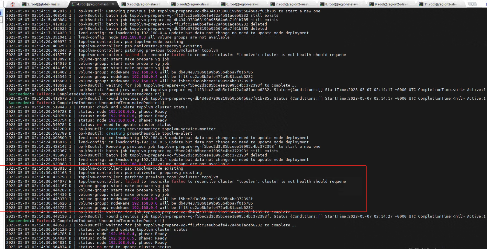
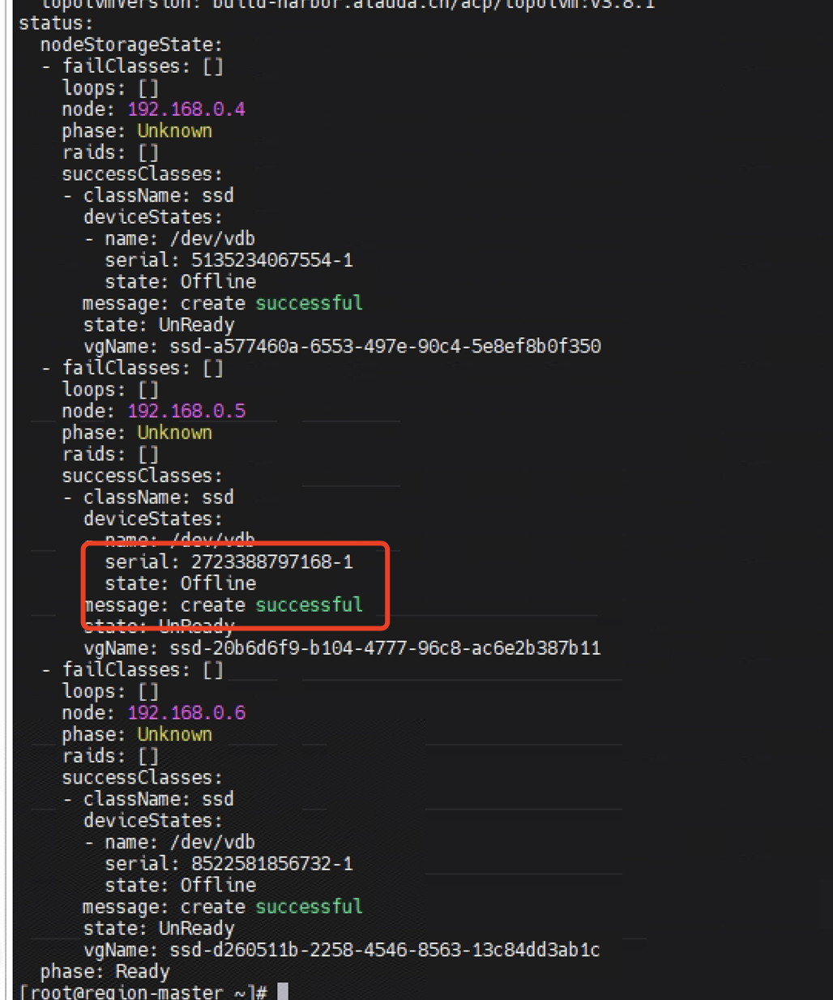
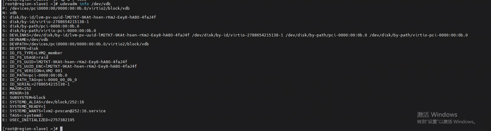
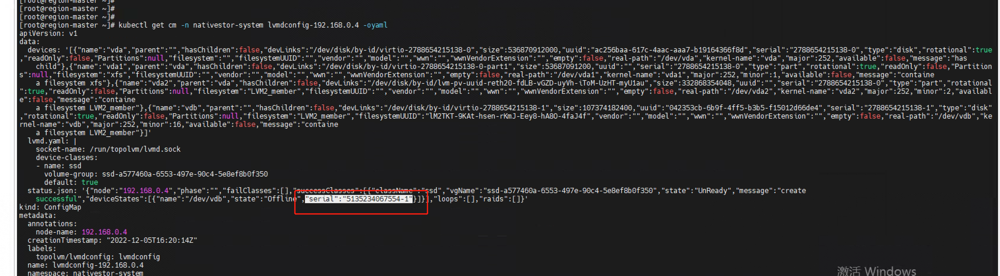

---
kind:
  - Troubleshooting
products:
  - Alauda Container Platform
  - Alauda DevOps
  - Alauda AI
  - Alauda Application Services
  - Alauda Service Mesh
  - Alauda Developer Portal
ProductsVersion:
  - 4.1.0,4.2.x
---
<!-- A type of document that involves encountering a fault, diagnosing it, performing root cause analysis, and providing solutions. -->

# topolvm节点状态未知

topolvm节点状态显示未知 topolvm cluster中的node状态为unknown operator报错: failed to reconcile cluster 'topolvm': cluster is not health should requene

## Cause
- 节点磁盘的serial state为offline
- 节点磁盘的实际serial值与配置的serial值不符
- lvmconfig-<node_ip> ConfigMap中status.json的serial值不匹配实际值

## Resolution
- 停止topolvm-operator
- 更新lvmconfig-<node_ip> ConfigMap中的status.json的serial值
- 删除discover-device的DaemonSet资源
- 重启topolvm-operator等待discover-device重建

## [workaround]

## [Related Information]
**Screenshots**

- Environment: 3.10.x
- topolvm-cluster
- lvmconfig-<node_ip>
- discover-device
- volumesnapsh
- status.json
- Component: Node
- Page ID: 146358923
- Original Title: topolvm节点状态未知
