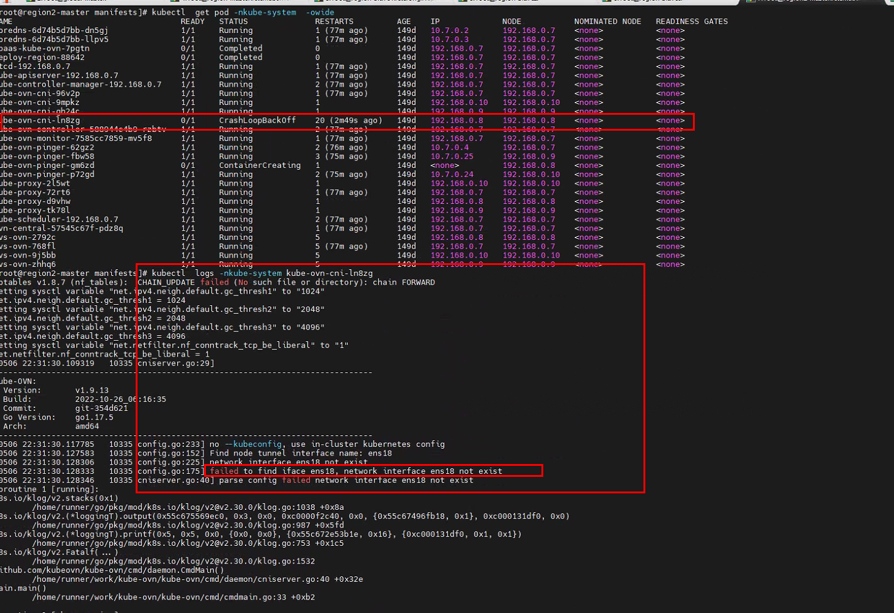
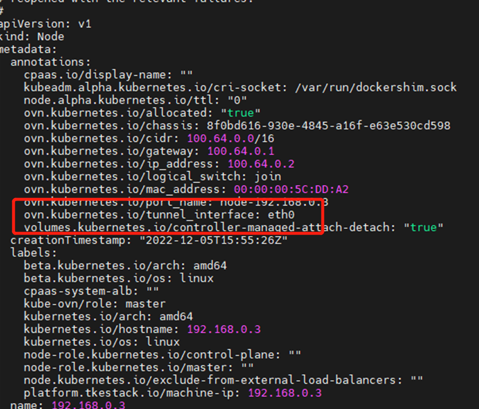

---
kind:
  - Troubleshooting
products:
  - Alauda Container Platform
  - Alauda DevOps
  - Alauda AI
  - Alauda Application Services
  - Alauda Service Mesh
  - Alauda Developer Portal
ProductsVersion:
  - 4.1.0,4.2.x
---
<!-- A type of document that involves encountering a fault, diagnosing it, performing root cause analysis, and providing solutions. -->

# 主机备份恢复后，节点网卡信息存在变更，导致ovn

ovn-cni启动失败 提示查询到错误网卡

## Cause
- 主机备份恢复后节点网卡信息变更

## Resolution
- kubectl edit node <nodename>设置正确的网卡信息

## [workaround]

## [Related Information]
**Screenshots**

- Environment: 3.10.2
- ovn-cni
- node资源
- 网卡配置
- Component: Node
- Page ID: 146359302
- Original Title: 主机备份恢复后，节点网卡信息存在变更，导致ovn-cni启动失败，提示失败查询到错误网卡
