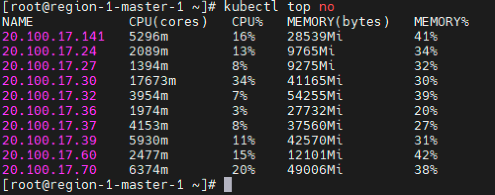
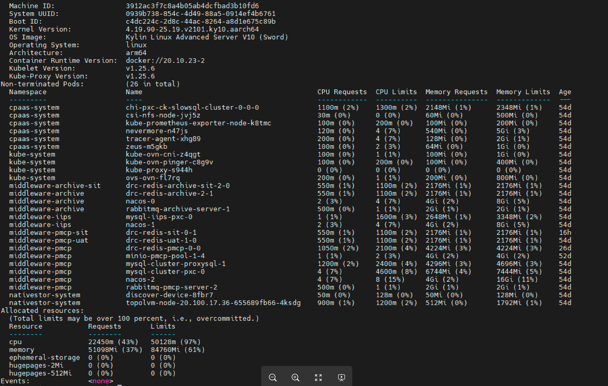
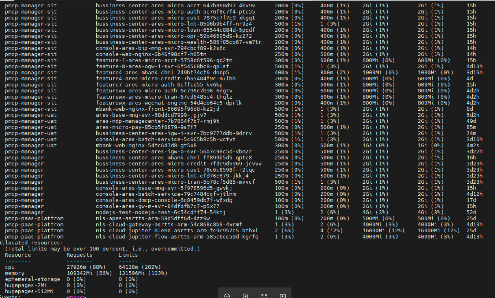
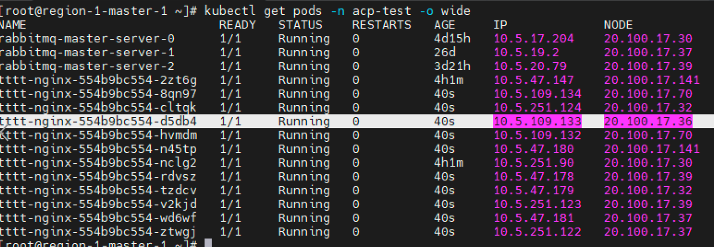

---
kind:
  - Troubleshooting
products:
  - Alauda Container Platform
  - Alauda DevOps
  - Alauda AI
  - Alauda Application Services
  - Alauda Service Mesh
  - Alauda Developer Portal
ProductsVersion:
  - 4.1.0,4.2.x
---
<!-- A type of document that involves encountering a fault, diagnosing it, performing root cause analysis, and providing solutions. -->

# pod调度不均衡

pod 往 36 节点上调度的几率小，但不是完全不调度 pod 往 70 和 141 节点调度几率高 节点36资源使用率40%，节点70资源使用率80%

## Cause
- kube-scheduler节点资源缓存异常（具体原因未明确）

## Resolution
- 重启kube-scheduler组件

## [workaround]

## [Related Information]
**Screenshots**

- Environment: TKE 3.10
- kube-scheduler
- node资源requests
- imagePullPolicy: Always
- Component: Node
- Page ID: 152657734
- Original Title: pod调度不均衡
