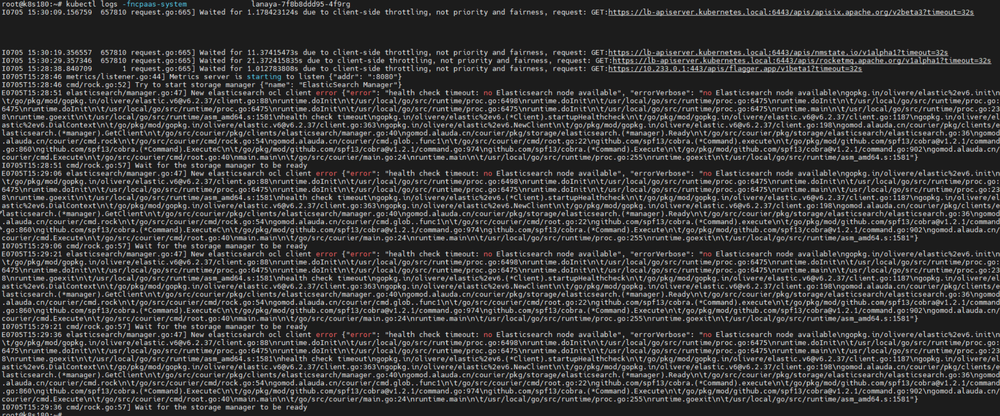
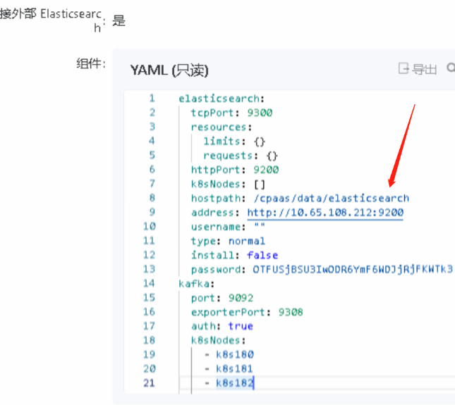

---
kind:
  - Troubleshooting
products:
  - Alauda Container Platform
  - Alauda DevOps
  - Alauda AI
  - Alauda Application Services
  - Alauda Service Mesh
  - Alauda Developer Portal
ProductsVersion:
  - 4.1.0,4.2.x
---
<!-- A type of document that involves encountering a fault, diagnosing it, performing root cause analysis, and providing solutions. -->

# 对接的外部es后lanaya启动失败

lanaya启动报错：no Elasticsearch node available

## Cause
- lanaya的deployment中配置了elasticsearch-basic-auth的secret，但对接的外部ES采用无认证方式

## Resolution
- 从lanaya的deployment中删除elasticsearch-basic-auth的secret配置

## [workaround]

## [Related Information]
**Screenshots**

- Environment: TKE 3.10.2
- elasticsearch-basic-auth
- lanaya-deployment
- 外部ES连接配置
- Component: Node
- Page ID: 152657763
- Original Title: 对接的外部es后lanaya启动失败
