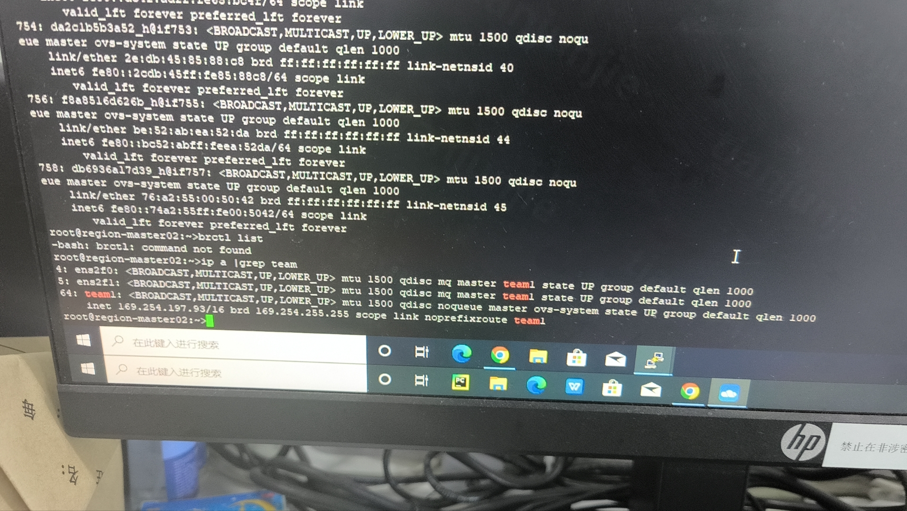
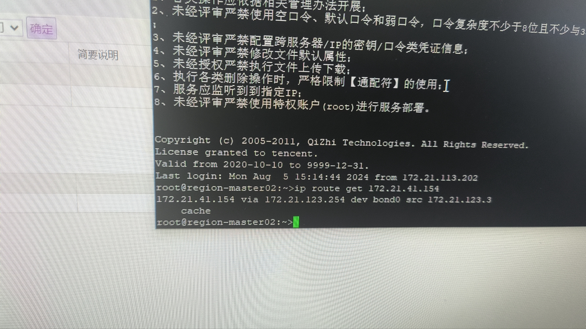
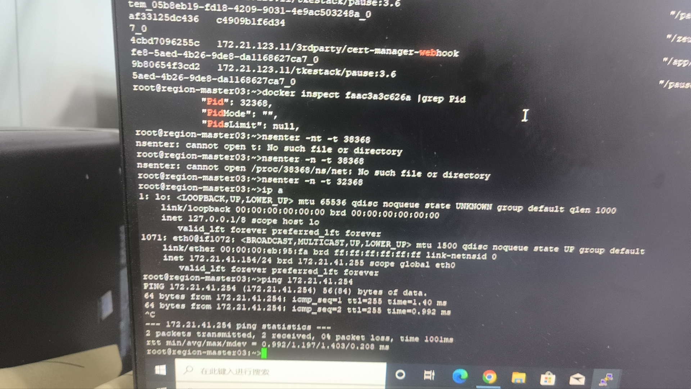
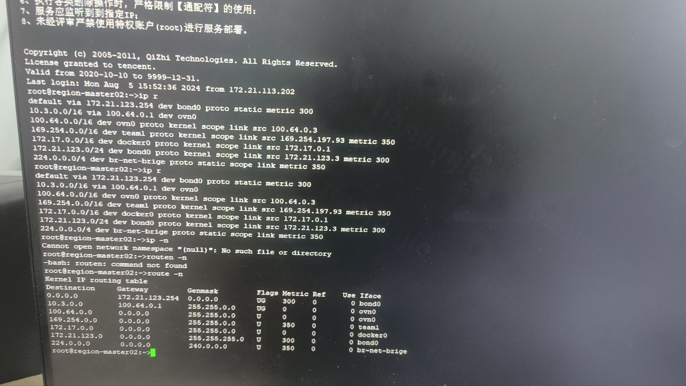
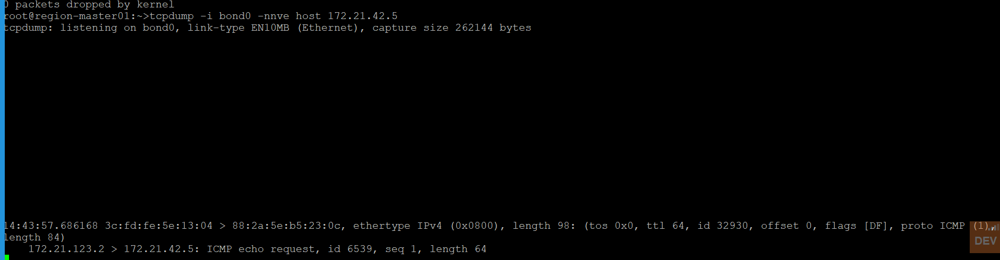
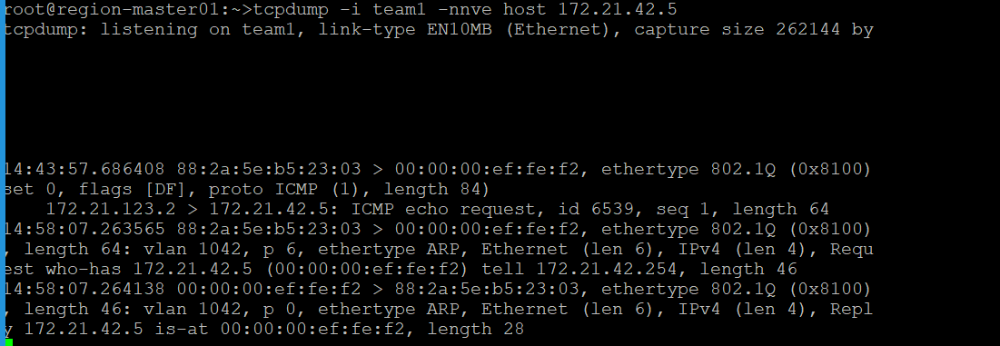
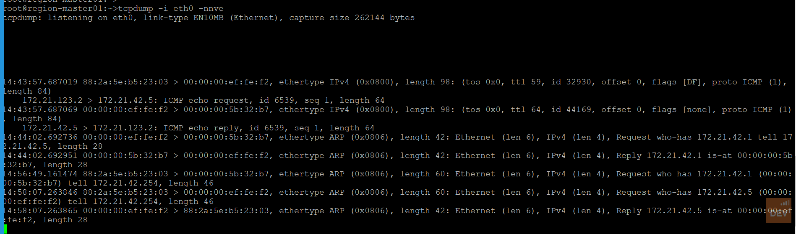
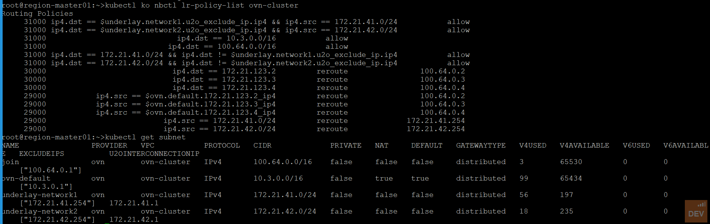

---
kind:
  - Troubleshooting
products:
  - Alauda Container Platform
  - Alauda DevOps
  - Alauda AI
  - Alauda Application Services
  - Alauda Service Mesh
  - Alauda Developer Portal
ProductsVersion:
  - 4.1.0,4.2.x
---
<!-- A type of document that involves encountering a fault, diagnosing it, performing root cause analysis, and providing solutions. -->

# 3.12.underlay集群,node访问节点上pod 不通

节点无法访问本节点上的Underlay Pod 本地节点IP无法ping通Pod IP 同网段外部节点可访问Underlay Pod IP

## Cause
- kube-ovn 1.9.14版本存在已知问题

## Resolution
- 更新kube-ovn版本

## [workaround]

## [Related Information]
**Screenshots**

- Environment: ACP 3.12.0 | kube-ovn 1.9.14 | 双网卡混布bond0+underlay网卡 | Underlay网关41.254
- kube-ovn
- bond0
- team1
- 策略路由
- 防火墙策略
- Component: Node
- Page ID: 225971418
- Original Title: 3.12.underlay集群,node访问节点上pod 不通
