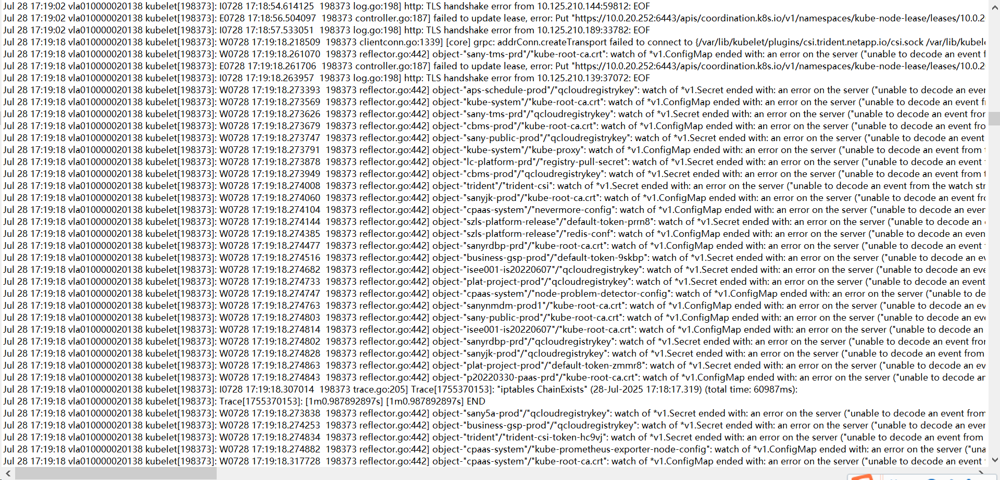
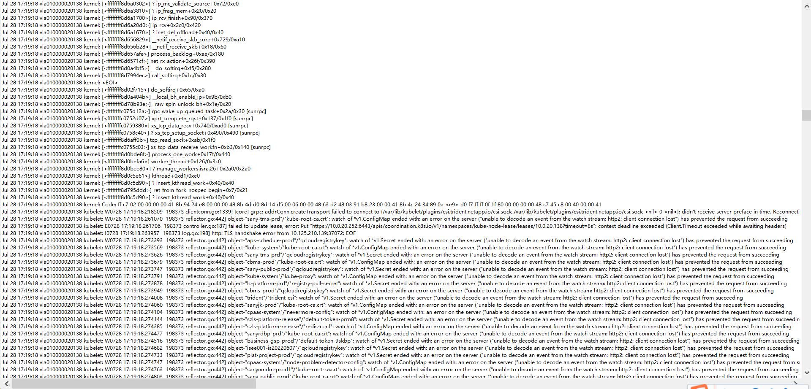
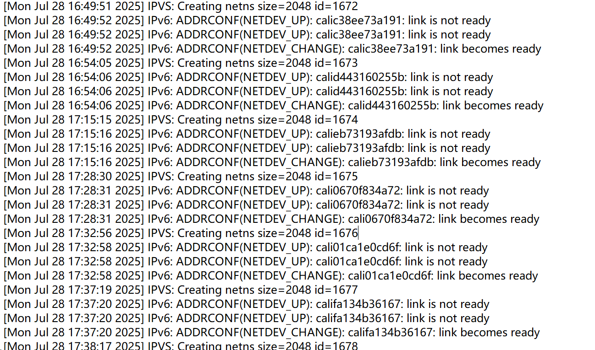

---
kind:
  - Troubleshooting
products:
  - Alauda Container Platform
  - Alauda DevOps
  - Alauda AI
  - Alauda Application Services
  - Alauda Service Mesh
  - Alauda Developer Portal
ProductsVersion:
  - 4.1.0,4.2.x
---
<!-- A type of document that involves encountering a fault, diagnosing it, performing root cause analysis, and providing solutions. -->

# 节点NodeNotReady  问题排查

kubelet 因资源竞争无法调度，docker 或 containerd 进程被 OOM Kill kubelet 日志出现 disk pressure 报错 x509: certificate has expired or is not yet valid 报错

## Cause
- CPU/Memory 不足
- 磁盘空间不足
- kubelet 服务未运行或崩溃
- 证书过期
- etcd 频繁切主
- 内核崩溃
- 主机迁移关机
- NTP 时间不同步

## Resolution
- free -h
- top -n1
- dmesg -T | grep -i "oom"
- df -Th
- journalctl -u kubelet | grep "disk pressure"
- systemctl status kubelet
- journalctl -u kubelet -f
- 续签相关证书
- dmesg 检查内核日志
- timedatectl status

## [workaround]

## [Related Information]
**Screenshots**

- Environment: 关键词：节点notready
- kubelet
- docker
- containerd
- etcd
- /var/log/messages
- dmesg
- journalctl
- x509 证书
- NTP
- Component: Node
- Page ID: 324174199
- Original Title: 基础架构-节点NodeNotReady  问题排查
