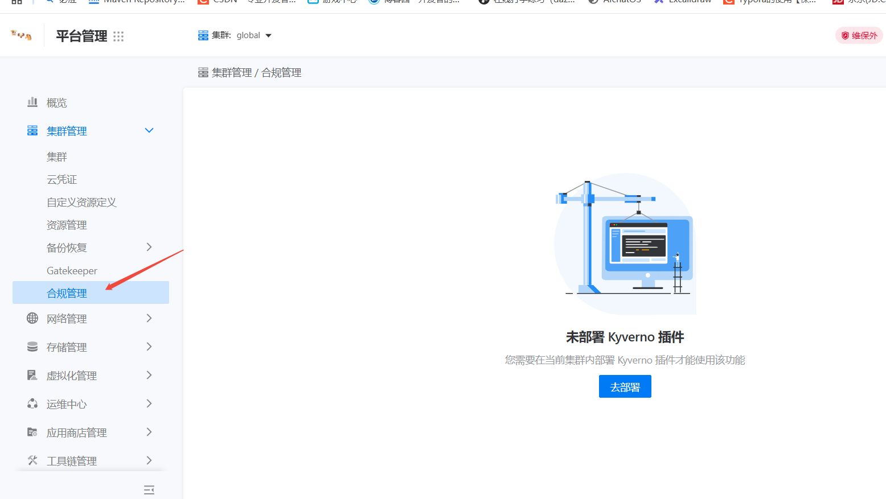

---
kind:
  - Troubleshooting
products:
  - Alauda Container Platform
  - Alauda DevOps
  - Alauda AI
  - Alauda Application Services
  - Alauda Service Mesh
  - Alauda Developer Portal
ProductsVersion:
  - 4.1.0,4.2.x
---
<!-- A type of document that involves encountering a fault, diagnosing it, performing root cause analysis, and providing solutions. -->

# GPU服务忽然无法启动

Pod无法调度到节点 报错node not fit pod 节点GPU资源不足

## Cause
- 应用异常退出导致GPU资源未被释放

## Resolution
- 在目标节点执行GPU资源重置命令：nvidia-smi --gpu-reset

## [workaround]

## [Related Information]
**Screenshots**

- Environment: 3.18.1
- nvidia-smi
- kubectl describe node
- kyverno合规管理
- 节点调度策略
- Component: Node
- Page ID: 327262410
- Original Title: 微服务-AI-GPU服务忽然无法启动-112696
