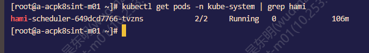
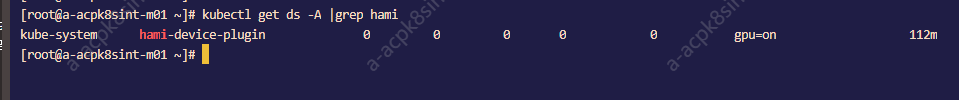
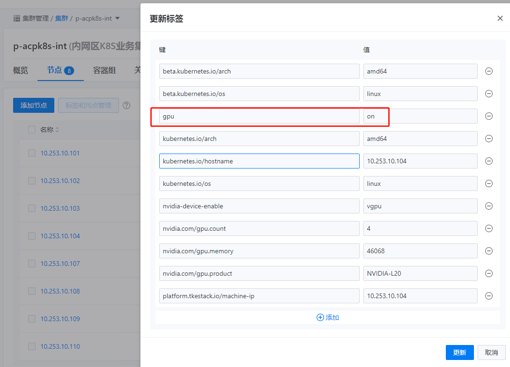
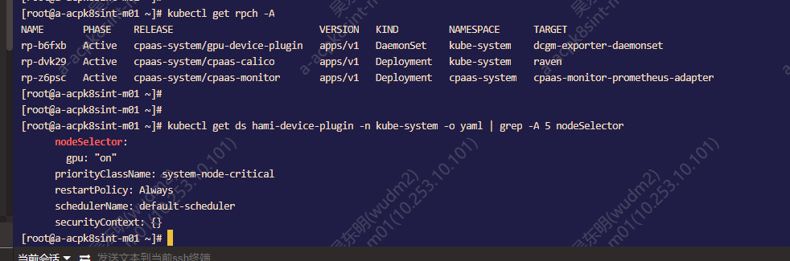

---
kind:
  - Troubleshooting
products:
  - Alauda Container Platform
  - Alauda DevOps
  - Alauda AI
  - Alauda Application Services
  - Alauda Service Mesh
  - Alauda Developer Portal
ProductsVersion:
  - 4.1.0,4.2.x
---
<!-- A type of document that involves encountering a fault, diagnosing it, performing root cause analysis, and providing solutions. -->

# hami部署上线后无法正常应用

无法查询可调度的GPU资源 (kubectl get node 10.253.10.104 -o=jsonpath='{.status.allocatable}') 应用分配GPU资源后无法正常调度 监控面板无hami类型选择查看pod监控

## Cause
- GPU节点设置了污点，但hami-device-plugin DaemonSet未配置对应容忍

## Resolution
- 在hami-device-plugin DaemonSet配置中添加对应污点容忍

## [workaround]
- 移除应用GPU资源配置后可正常调度至GPU节点

## [Related Information]
**Screenshots**

- Environment: 3.18.1
- hami-device-plugin
- node标签(gpu:on)
- DaemonSet配置
- 污点配置
- Component: Node
- Page ID: 327812218
- Original Title: 微服务-hami部署上线后无法正常应用-114667
