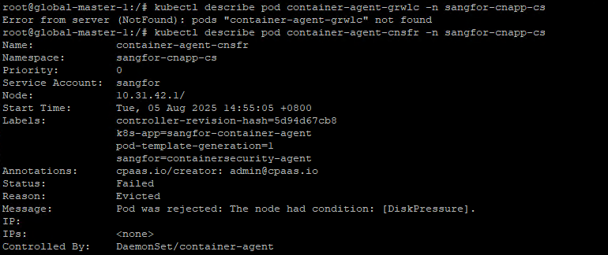

---
kind:
  - Troubleshooting
products:
  - Alauda Container Platform
  - Alauda DevOps
  - Alauda AI
  - Alauda Application Services
  - Alauda Service Mesh
  - Alauda Developer Portal
ProductsVersion:
  - 4.1.0,4.2.x
---
<!-- A type of document that involves encountering a fault, diagnosing it, performing root cause analysis, and providing solutions. -->

# container

kubectl describe pod container-agent-grwlc -n sangfor-cnapp-cs 返回 Error from server (NotFound): pods "container-agent-grwlc" not found container-agent-cnsfr Pod状态为Failed Evicted原因为: The node had condition: [DiskPressure]

## Cause
- 节点磁盘使用率达到93%触发DiskPressure

## Resolution
- 释放节点磁盘空间

## [workaround]

## [Related Information]
**Screenshots**

- Environment: 3.14.2
- DaemonSet/container-agent
- k8s-app=sangfor-container-agent
- sangfor=containersecurity-agent
- Component: Node
- Page ID: 327812468
- Original Title: 容器平台-container-agent的一个pod无法启动-114442
