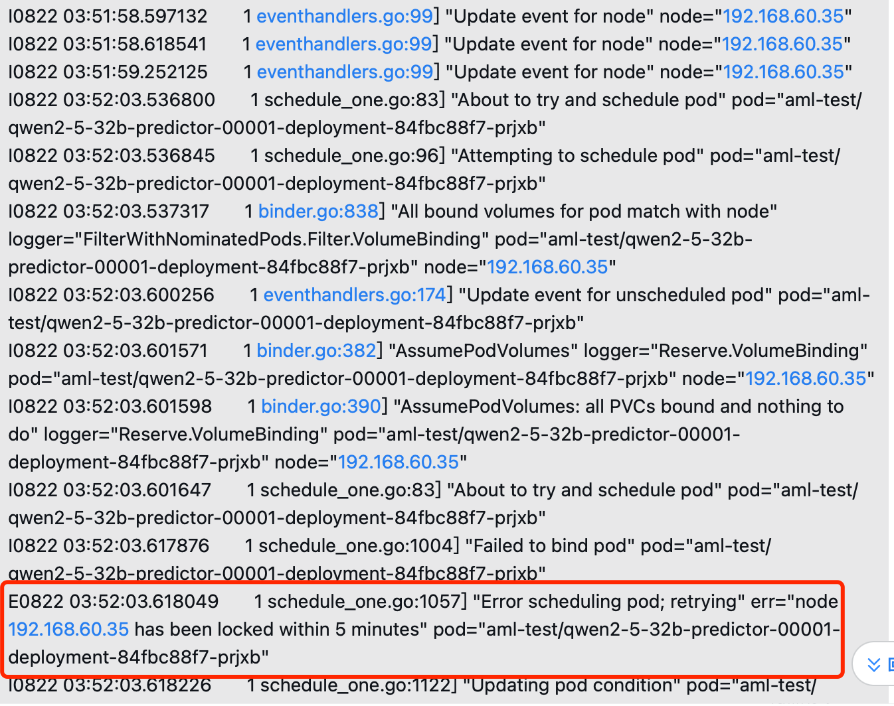

---
kind:
  - Troubleshooting
products:
  - Alauda Container Platform
  - Alauda DevOps
  - Alauda AI
  - Alauda Application Services
  - Alauda Service Mesh
  - Alauda Developer Portal
ProductsVersion:
  - 4.1.0,4.2.x
---
<!-- A type of document that involves encountering a fault, diagnosing it, performing root cause analysis, and providing solutions. -->

# hami 调度器将 Node 锁住无法进行调度

Node 被锁住导致其他 Pod 无法调度

## Cause
- Pod 在 bind 阶段被意外删除导致 NodeLock 悬空

## Resolution
- 升级 HAMi 至 2.7 版本（包含 PR 1271 修复）

## [workaround]
- 重启 hami 调度器组件
- 执行 `kubectl annotate node <node-name> hami.io/mutex.lock-` 手动删除 Node 的锁

## [Related Information]
**Screenshots**

- Environment: HAMi 2.7 之前
- hami.io/mutex.lock
- HAMi 调度器
- Component: Node
- Page ID: 333742485
- Original Title: hami 调度器将 Node 锁住无法进行调度
