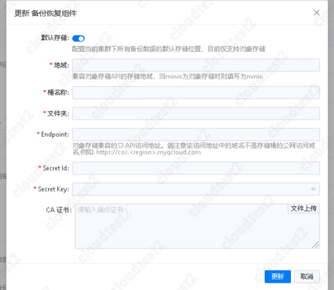
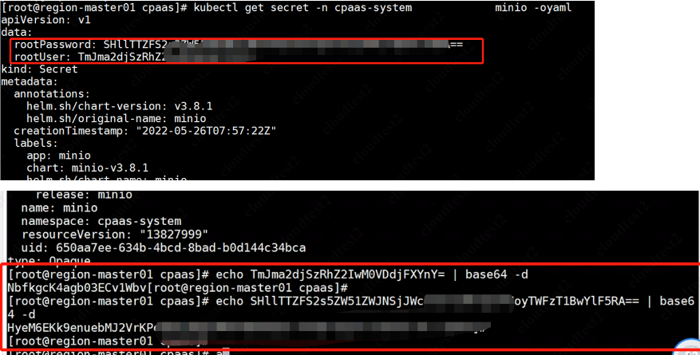

---
kind:
  - Troubleshooting
products:
  - Alauda Container Platform
  - Alauda DevOps
  - Alauda AI
  - Alauda Application Services
  - Alauda Service Mesh
  - Alauda Developer Portal
ProductsVersion:
  - 4.1.0,4.2.x
---
<!-- A type of document that involves encountering a fault, diagnosing it, performing root cause analysis, and providing solutions. -->

# 部署备份恢复组件

部署备份恢复组件时信息填写部分不明确，无法找到正确的信息

## Cause
- 未正确获取minio服务地址和认证信息

## Resolution
- 通过命令获取minio服务地址：kubectl get svc -n cpaas-system | grep minio
- 通过命令获取secret信息并解码：kubectl get secret -n cpaas-system minio -oyaml | 解码rootUser和rootPassword字段

## [workaround]

## [Related Information]
**Screenshots**

- Environment: 3.8.x
- minio-svc
- minio-secret
- 9000
- rootUser
- rootPassword
- Component: 备份恢复组件
- Page ID: 124682438
- Original Title: 部署备份恢复组件
