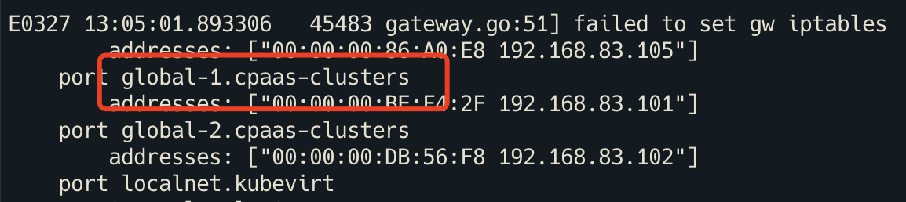

---
kind:
  - Troubleshooting
products:
  - Alauda Container Platform
  - Alauda DevOps
  - Alauda AI
  - Alauda Application Services
  - Alauda Service Mesh
  - Alauda Developer Portal
ProductsVersion:
  - 4.1.0,4.2.x
---
<!-- A type of document that involves encountering a fault, diagnosing it, performing root cause analysis, and providing solutions. -->

# cp

global虚拟机访问不通 OVS DB中interface的external-ids记录旧的虚拟机Pod信息

## Cause
- lsp命名方式从PodName.Namespace变更为vmName.Namespace导致地址冲突
- OVS DB未同步新的iface-id参数
- IP CRD恢复时因lsp名称变化产生冲突

## Resolution
- 手动修改OVS接口的iface-id为vmName.Namespace组合

## [workaround]

## [Related Information]
**Screenshots**

- Environment: cp-dev开发环境，Kube-OVN v1.8.3+版本启用--keep-vm-ip=true参数
- kube-ovn-controller
- OVN NB DB
- OVS DB
- IP CRD
- lsp命名规则
- external_ids参数
- --keep-vm-ip=true
- Component: 虚拟机
- Page ID: 112044487
- Original Title: cp-dev 开发环境，global 虚拟机访问不通
