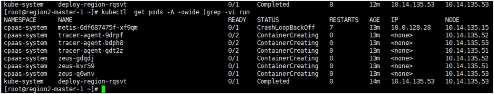
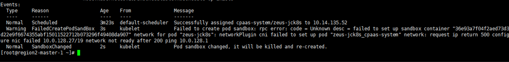

---
kind:
  - Troubleshooting
products:
  - Alauda Container Platform
  - Alauda DevOps
  - Alauda AI
  - Alauda Application Services
  - Alauda Service Mesh
  - Alauda Developer Portal
ProductsVersion:
  - 4.1.0,4.2.x
---
<!-- A type of document that involves encountering a fault, diagnosing it, performing root cause analysis, and providing solutions. -->

# 3.6

部分pod处于creating状态 cni报错ping网关not ready master节点上的pod一直处于creating状态

## Cause
- 虚拟机混杂模式未开启

## Resolution
- 参考OPS-94887239-091021-1526-1243.pdf文档开启虚拟机混杂模式

## [workaround]

## [Related Information]
**Screenshots**

- Environment: Kubernetes 3.x版本，underlay网络模式，VMware虚拟机环境
- 混杂模式
- underlay子网网关
- vmvare虚拟机
- cni插件
- Component: 虚拟机
- Page ID: 112065490
- Original Title: 3.6-部署-新建集群pod启动失败
