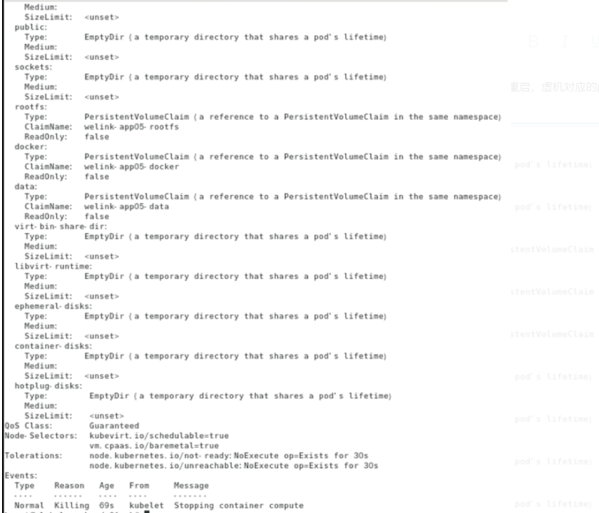

---
kind:
  - Troubleshooting
products:
  - Alauda Container Platform
  - Alauda DevOps
  - Alauda AI
  - Alauda Application Services
  - Alauda Service Mesh
  - Alauda Developer Portal
ProductsVersion:
  - 4.1.0,4.2.x
---
<!-- A type of document that involves encountering a fault, diagnosing it, performing root cause analysis, and providing solutions. -->

# kubevirt 创建虚拟机在后台主机重启后无法启动

虚机对应的pod一直删除中 新起来的pod报错，磁盘被占用无法启动 相关存储无法挂载

## Cause
- 服务重启后存储无法卸载
- 强制关闭服务后后台存储仍处于挂载状态

## Resolution
- 找到卡terminating的pod所在节点: kubectl -n daybuild-cluster-a get vmi | grep Failed
- 查看vm对应的磁盘: kubectl -n daybuild-cluster-a get po virt-launcher-p2230-auto-dep-r-3-4dc-wgxdn -o yaml | grep claimName | grep -v rootfs
- 查看对应pvc的pv信息: kubectl -n daybuild-cluster-a get pvc p2230-auto-dep-r-3-4dc-vdb
- 在对应节点执行: losetup -a | grep <pvc-id>
- 检查loop设备映射: lsblk /dev/loop<X>
- 卸载device mapper: dmsetup remove /dev/mapper/<mapper-device-name>

## [workaround]

## [Related Information]
**Screenshots**

- Environment: 3.8.1
- ceph
- pvc
- pv
- device mapper
- loop设备
- virt-launcher
- Component: 虚拟机
- Page ID: 115525659
- Original Title: 容器平台-kubevirt 创建虚拟机在后台主机重启后无法启动-报错相关存储无法挂载
