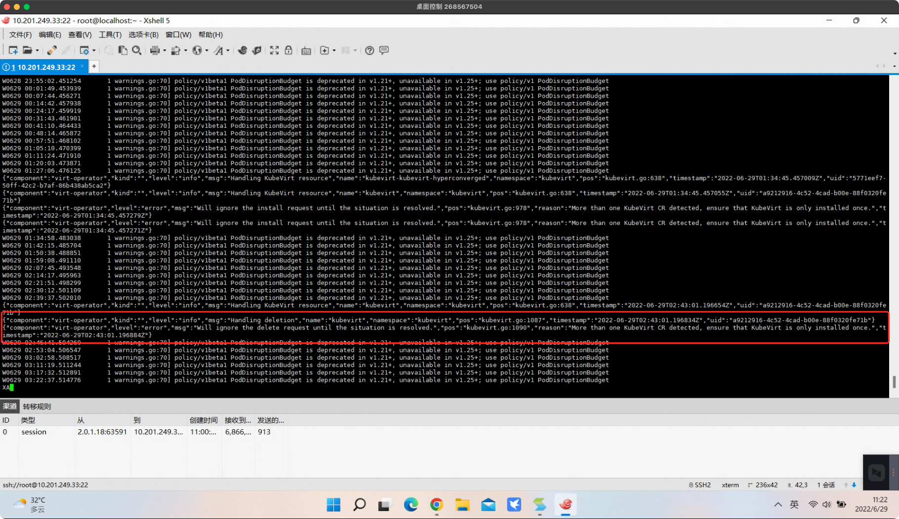
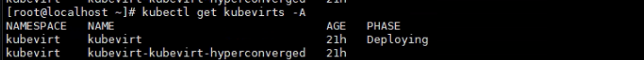

---
kind:
  - Troubleshooting
products:
  - Alauda Container Platform
  - Alauda DevOps
  - Alauda AI
  - Alauda Application Services
  - Alauda Service Mesh
  - Alauda Developer Portal
ProductsVersion:
  - 4.1.0,4.2.x
---
<!-- A type of document that involves encountering a fault, diagnosing it, performing root cause analysis, and providing solutions. -->

# 3.8.1部署虚拟机报错：fake

部署虚拟机时报错：fake-validtion-service not found virt-operator 日志显示存在两个 kubevirt CR 资源 执行 kubectl get kubevirt -A 确认存在两个 kubevirt CR

## Cause
- 手动创建了 kubevirt 类型的 CR 导致冲突
- 正常环境应通过 HyperConverged CR 自动创建 kubevirt 和 cdi CR

## Resolution
- 删除手动创建的 kubevirt CR，仅保留 HyperConverged 自动生成的 CR

## [workaround]

## [Related Information]
**Screenshots**

- Environment: 3.8.1
- kubevirt CR
- HyperConverged CR
- cdi CR
- virt-operator
- Component: 虚拟机
- Page ID: 119086025
- Original Title: 3.8.1部署虚拟机报错：fake-validtion-service not found
